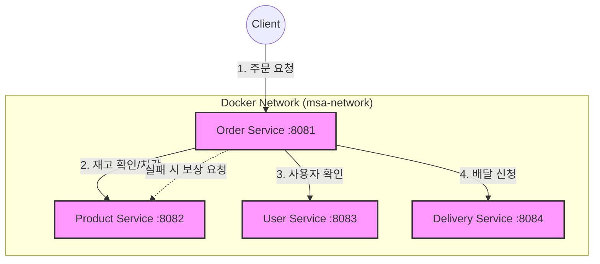

# 🚀 MSA 실습 프로젝트 분석 리포트 (Chap 01)

## 1. MSA(Microservices Architecture)란?
마이크로서비스 아키텍처는 하나의 큰 애플리케이션을 **독립적으로 배포 가능한 여러 개의 작은 서비스**들로 나누어 구성하는 방식입니다. 

*   **독립성:** 각 서비스는 자신만의 DB를 가지며, 특정 기술 스택에 종속되지 않습니다.
*   **통신:** 서비스 간에는 주로 HTTP(REST)나 메시지 큐(Kafka, RabbitMQ)를 통해 데이터를 주고받습니다.
*   **확장성:** 특정 서비스(예: 주문 폭주 시 주문 서비스만)의 성능을 개별적으로 확장하기 유리합니다.

---

## 2. 프로젝트 전체 흐름 및 아키텍처
이 프로젝트는 **사용자(User), 상품(Product), 주문(Order), 배달(Delivery)** 4개의 서비스가 협력하여 하나의 주문 프로세스를 완성합니다.

### 🔄 비즈니스 워크플로우 (주문 생성 시)
1.  **사용자**가 주문 서비스에 주문 요청을 보냅니다.
2.  **주문 서비스**는 **상품 서비스**에 요청하여 재고를 차감합니다.
3.  재고 차감이 성공하면, **주문 서비스**는 **배달 서비스**에 요청하여 배달 정보를 생성합니다.
4.  만약 배달 생성 중 오류가 발생하면, 주문 서비스는 이미 성공했던 **상품 서비스의 재고 차감을 취소(보상 트랜잭션)**하여 데이터 일관성을 맞춥니다.

### 📊 서비스 구성도 (Mermaid)



---

## 3. Docker의 역할과 작동 방식
도커는 각 마이크로서비스를 **컨테이너**라는 독립된 환경에 가두어, 어디서든 동일하게 실행될 수 있도록 보장합니다.

### 🐳 Docker 작동 흐름
1.  **Build:** `Dockerfile`을 읽어 실행 파일(JAR)이 포함된 **이미지**를 만듭니다.
2.  **Ship:** 만들어진 이미지를 도커 엔진에 등록합니다.
3.  **Run:** `docker-compose.yml` 설정을 따라 여러 개의 컨테이너를 동시에 띄우고 가상 네트워크(`msa-network`)로 연결합니다.

---

## 4. 도커 설정 코드 설명

### 📄 Dockerfile (각 서비스 공통)
각 서비스 폴더 안에 위치하며, 자바 앱을 실행하기 위한 환경을 정의합니다.

```dockerfile
# 1. 베이스 이미지 설정: 자바 실행 환경(JDK 21)을 가져옵니다.
FROM openjdk:21-jdk-slim

# 2. 작업 디렉토리 설정: 컨테이너 내부에서 명령어가 실행될 폴더입니다.
WORKDIR /app

# 3. 빌드 파일 복사: Gradle로 빌드된 jar 파일을 컨테이너 내부로 복사합니다.
# (호스트의 build/libs/*.jar -> 컨테이너의 app.jar)
COPY build/libs/*.jar app.jar

# 4. 포트 개방: 이 컨테이너가 사용할 포트를 외부에 알립니다.
EXPOSE 8081

# 5. 실행 명령어: 컨테이너가 시작될 때 자바 앱을 실행합니다.
ENTRYPOINT ["java", "-jar", "app.jar"]
```

### 📄 docker-compose.yml (루트 폴더)
모든 서비스를 한 번에 관리하고 서로 통신할 수 있게 묶어주는 설계도입니다.

```yaml
services:
  # --- 주문 서비스 설정 ---
  order-service:
    build:
      context: ./order     # 'order' 폴더에 있는 Dockerfile을 사용하여 빌드
    ports:
      - "8081:8081"        # 호스트PC 포트 8081 : 컨테이너 포트 8081 연결
    networks:
      - msa-network        # 가상 네트워크 참여 (이 이름으로 서로 통신 가능)
    depends_on:            # 의존성 설정: 다른 서비스들이 먼저 떠야 실행됨
      - user-service
      - product-service
      - delivery-service

  # --- 상품 서비스 설정 ---
  product-service:
    build:
      context: ./product
    ports:
      - "8082:8082"
    networks:
      - msa-network

  # (중략: user, delivery 서비스도 동일한 구조)

networks:
  msa-network:             # 모든 서비스가 서로를 '이름'으로 찾을 수 있게 해주는 전용 망
```

---

## 💡 학습 팁
*   **서비스 간 호출:** `OrderService` 내부를 보시면 `http://product-service:8082/...` 와 같은 URL을 사용합니다. 도커 네트워크 덕분에 IP 주소 대신 **서비스 이름**을 호스트 이름으로 사용할 수 있습니다.
*   **분산 트랜잭션:** 이 프로젝트는 완벽한 분산 트랜잭션 솔루션(Saga 패턴 등)을 쓰기 전 단계로, 코드로 직접 실패 처리를 구현하고 있습니다. `OrderService.java`의 `try-catch` 부분을 유심히 살펴보세요!
