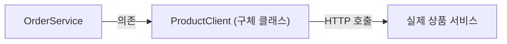
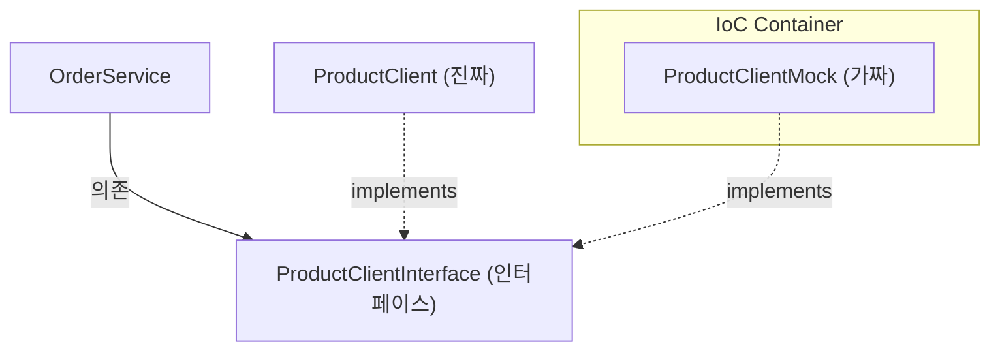

# 🏗️ DIP와 Mock을 이용한 MSA 병렬 개발 전략 리포트

## 1. 문제 상황: 협업 부서의 기능이 아직 미완성이라면?

주문 서비스(`Order Service`)를 개발해야 하는데, 상품 서비스(`Product Service`) 담당자가 재고 차감 API(`decreaseQuantity`)를 아직 완성하지 못했다면?

- **기존 방식:** 상품 서비스가 완성될 때까지 주문 서비스 개발을 멈추고 기다려야 함 (직렬 개발).
- **DIP 방식:** 인터페이스를 먼저 정의하고, 가짜(`Mock`) 객체를 만들어 내 로직을 먼저 테스트함 (병렬 개발).

---

## 2. 의존성 구조 변화 (Mermaid)

### ❌ 개선 전: 강한 결합 (Tight Coupling)
`OrderService`가 구체적인 클래스인 `ProductClient`에 직접 의존합니다. `ProductClient`가 고장 나거나 없으면 `OrderService`도 동작하지 않습니다.



### ✅ 개선 후: DIP (의존 역전 원칙) 적용
`OrderService`는 인터페이스에 의존하고, 실제 구현체(`Real` or `Mock`)는 런타임에 결정됩니다.



---

## 3. 코드 구현 (Step by Step)

### [Step 1] 인터페이스 정의 (추상화)

먼저 어떤 기능이 필요한지 규약을 정의합니다.

```java
// ProductClientInterface.java
public interface ProductClientInterface {
    void decreaseQuantity(ProductRequest requestDTO);
    void increaseQuantity(ProductRequest requestDTO);
}
```

### [Step 2] 가짜 구현체 만들기 (Mock)

상품 서비스가 없어도 에러가 나지 않도록 가짜 로직을 작성합니다.

```java
// ProductClientMock.java
@Component // IoC 컨테이너에 등록
public class ProductClientMock implements ProductClientInterface {
    @Override
    public void decreaseQuantity(ProductRequest requestDTO) {
        // 실제 통신은 하지 않고 로그만 남김
        System.out.println("Mock: 상품 " + requestDTO.productId() + " 재고 " + requestDTO.quantity() + "개 차감 완료 (가짜)");
    }

    @Override
    public void increaseQuantity(ProductRequest requestDTO) {
        System.out.println("Mock: 상품 " + requestDTO.productId() + " 재고 복구 완료 (가짜)");
    }
}
```

### [Step 3] 진짜 구현체 수정

실제 통신 로직도 인터페이스를 구현하도록 수정합니다. (단, 테스트 중에는 `@Component`를 잠시 주석 처리합니다.)

```java
// ProductClient.java
// @Component // Mock과 충돌 방지를 위해 잠시 주석 처리하거나 @Primary 사용
public class ProductClient implements ProductClientInterface {
    private final RestClient restClient;
    // ... 실제 RestClient 로직
}
```

### [Step 4] OrderService 의존성 주입 수정

구체 클래스가 아닌 **인터페이스**를 주입받습니다.

```java
// OrderService.java
@Service
@RequiredArgsConstructor
public class OrderService {
    // 구체 클래스(ProductClient)가 아닌 인터페이스에 의존! (DIP)
    private final ProductClientInterface productClient;

    @Transactional
    public void createOrder(...) {
        // 인터페이스의 메서드를 호출.
        // 실제 실행 시점에는 IoC에 떠있는 Mock 객체가 들어옴.
        productClient.decreaseQuantity(new ProductRequest(...));
    }
}
```

---

## 💡 핵심 개념 정리 (학습용)

### 1. DIP (Dependency Inversion Principle - 의존 역전 원칙)

- **정의:** "상위 모듈은 하위 모듈에 의존해서는 안 된다. 둘 다 추상화에 의존해야 한다."
- **효과:** `OrderService`(상위)가 `ProductClient`(하위)를 직접 보지 않고 인터페이스(추상화)만 봄으로써, 하위 모듈이 바뀌어도(Mock -> Real) 상위 모듈 코드를 고칠 필요가 없습니다.

### 2. @Component (스프링 빈 등록의 핵심)

- **정의:** 스프링이 관리하는 객체(Bean)임을 표시하는 가장 기본적인 어노테이션입니다.
- **역할:**
  - **컴포넌트 스캔:** 스프링 서버가 뜰 때, `@Component`가 붙은 클래스들을 자동으로 찾아내어 객체를 생성(new)합니다.
  - **IoC 컨테이너 등록:** 생성된 객체들을 'IoC 컨테이너'라는 저장소에 보관합니다.
  - **자동 주입:** 다른 클래스(예: OrderService)에서 이 객체가 필요할 때, 스프링이 컨테이너에서 꺼내서 자동으로 연결해줍니다.
- **비유:** 식당(스프링)의 주방 도구(객체)에 "공용 도구"라고 이름표(@Component)를 붙여두면, 요리사(개발자)가 직접 도구를 사오지 않아도 식당이 미리 준비해주는 것과 같습니다.

### 3. IoC (Inversion of Control - 제어의 역전)

- **정의:** 객체의 생성과 생명주기 관리를 개발자가 아닌 **스프링 컨테이너**가 대신 해주는 것입니다.
- **충돌 상황:** 같은 인터페이스를 구현한 클래스가 두 개 이상 `@Component`로 등록되면, 스프링은 어떤 것을 주입할지 몰라 에러(`NoUniqueBeanDefinitionException`)를 발생시킵니다.

### 4. @Primary와 @Profile (꿀팁)

둘 다 `@Component`를 달고 싶을 때 해결 방법입니다.

- **@Primary:** 두 개 중 우선순위를 정합니다. `Mock`에 `@Primary`를 달면 `Mock`이 먼저 주입됩니다.
- **@Profile:** 환경에 따라 나눕니다. `@Profile("dev")`는 개발 서버에서, `@Profile("prod")`는 실 운영 서버에서만 작동하게 설정할 수 있습니다.

---

## 🚀 결론

학원에서 배우신 방법은 **유연한 설계**를 위한 정석입니다.
이렇게 개발하면 상품 서비스 팀이 서버를 꺼두거나 아직 코딩 중이라도, 주문 서비스 팀은 `Mock`을 이용해 자신의 로직(DB 저장, 배달 호출 등)을 완벽하게 테스트할 수 있습니다. 이것이 MSA의 진정한 **독립적 개발**입니다!
