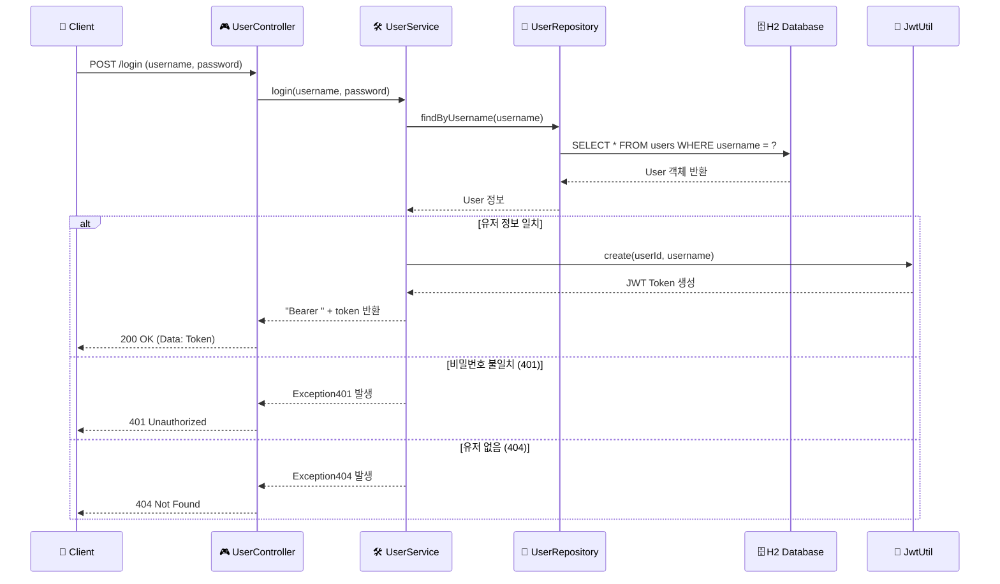

# 🔐 로그인 프로세스 & 서비스 설정(Config) 심층 분석 리포트

## 1. 로그인 전체 작업 흐름 (User Service)

`POST /login` 요청이 들어왔을 때, 클라이언트 입장에서 실행되는 메서드 순서와 흐름입니다.

### 📊 로그인 시퀀스 다이어그램 (Mermaid)



### 💻 실행 코드 및 주석 (실행 순서)

1. **UserController.login()**: 클라이언트의 요청을 가장 먼저 받는 진입점입니다.
```java
@PostMapping("/login")
public ResponseEntity<?> login(@RequestBody UserRequest requestDTO) {
    // 1. 클라이언트가 보낸 JSON 데이터를 UserRequest 객체로 받음
    // 2. 서비스 계층의 login 메서드를 호출하여 결과(토큰)를 받음
    // 3. Resp.ok()를 통해 표준 응답 포맷(200 OK)으로 감싸서 반환
    return Resp.ok(userService.login(requestDTO.username(), requestDTO.password()));
}
```

2. **UserService.login()**: 실제 비즈니스 로직(검증 및 토큰 생성)을 수행합니다.
```java
@Transactional
public String login(String username, String password) {
    // 1. DB에서 유저 존재 여부 확인 (없으면 404 예외)
    User findUser = userRepository.findByUsername(username)
            .orElseThrow(() -> new Exception404("유저네임을 찾을 수 없습니다."));
            
    // 2. 입력된 비밀번호와 DB의 비밀번호 비교 (다르면 401 예외)
    if (!findUser.getPassword().equals(password)) {
        throw new Exception401("비밀번호가 일치하지 않습니다.");
    }
    
    // 3. 인증 성공 시, JwtUtil을 사용해 서버 서명이 담긴 토큰 생성
    String token = jwtUtil.create(findUser.getId(), findUser.getUsername());
    
    // 4. 클라이언트가 관례적으로 사용하는 "Bearer " 접두사를 붙여 반환
    return TOKEN_PREFIX + token;
}
```

3. **JwtUtil.java**: 실제 JWT 토큰을 생성하고 검증하는 유틸리티 클래스입니다.
```java
@Component
public class JwtUtil {
    // 1. 토큰 생성: 사용자의 ID와 이름을 담아 암호화된 토큰을 만듦
    public String create(int userId, String username) {
        return JWT.create()
                .withSubject(String.valueOf(userId)) // 주제(Subject)에 userId 저장
                .withClaim("username", username)     // 클레임(Claim)에 username 저장
                .withExpiresAt(new Date(System.currentTimeMillis() + expirationTime)) // 만료 시간 설정
                .sign(Algorithm.HMAC512(secret));    // 서버만 아는 비밀키(secret)로 서명
    }

    // 2. 토큰 검증: 전달받은 토큰이 서버가 만든 게 맞는지 확인
    public DecodedJWT verify(String token) {
        return JWT.require(Algorithm.HMAC512(secret)) // 같은 비밀키로 검증기 생성
                .build()
                .verify(token); // 서명이 위조되었거나 만료되었다면 여기서 예외 발생!
    }
}
```
> **동작 원리:** JWT는 **'정보(Payload) + 서명(Signature)'** 구조입니다. 서버는 사용자의 정보를 Payload에 넣고, 서버의 비밀키로 Signature를 만듭니다. 나중에 사용자가 토큰을 가져오면, 서버는 Signature를 다시 계산해보고 Payload가 변조되지 않았는지 확인합니다. 즉, 서버는 DB를 뒤지지 않고도 토큰만 보고 "아, 이 사람은 홍길동이 맞구나!"라고 믿을 수 있게 됩니다.

---

## 2. 서비스 설정 파일(Config) 상세 분석

MSA 환경에서 각 서비스가 원활하게 동작하고 보안을 유지하기 위한 핵심 설정들입니다.

### 🛡️ WebConfig (보안 및 필터 설정)
- **위치:** `user/src/main/java/com/metacoding/user/core/config/WebConfig.java` 등
- **역할:** 특정 URL 요청에 대해 "검문소(필터)"를 세우는 역할을 합니다.

```java
@Bean
public FilterRegistrationBean<JwtAuthenticationFilter> jwtFilter() {
    FilterRegistrationBean<JwtAuthenticationFilter> registrationBean = new FilterRegistrationBean<>();
    registrationBean.setFilter(jwtAuthenticationFilter); // 1. 어떤 필터를 쓸 것인가? (JWT 검증 필터)
    registrationBean.addUrlPatterns("/api/*");          // 2. 어디에 적용할 것인가? (/api/로 시작하는 모든 요청)
    registrationBean.setOrder(1);                       // 3. 실행 순서는? (1순위)
    return registrationBean;
}
```
> **상황 설명:** 로그인은 누구나 할 수 있어야 하므로 `/login`은 필터를 거치지 않습니다. 하지만 `/api/users/1` 같이 개인 정보를 조회하는 요청은 `WebConfig`에 설정된 대로 `JwtAuthenticationFilter`를 반드시 거쳐야 하며, 여기서 토큰이 유효한지 검사합니다.

### 📡 RestClientConfig (서비스 간 인증 정보 전달)
- **위치:** `order/src/main/java/com/metacoding/order/core/config/RestClientConfig.java`
- **역할:** 서비스가 다른 서비스(예: Order -> Product)를 호출할 때, **현재 로그인한 사용자의 인증 토큰(JWT)을 그대로 복사해서 전달**해주는 역할을 합니다.

```java
ClientHttpRequestInterceptor authForwardingInterceptor = (request, body, execution) -> {
    // 1. 현재 이 서비스를 호출한 클라이언트의 요청 정보를 가져옴
    ServletRequestAttributes attributes = (ServletRequestAttributes) RequestContextHolder.getRequestAttributes();
    
    if (attributes != null) {
        // 2. 현재 요청의 헤더에서 "Authorization" (JWT 토큰)을 꺼냄
        String authorization = attributes.getRequest().getHeader("Authorization");
        
        if (authorization != null) {
            // 3. 다른 서비스로 보낼 새로운 요청 헤더에 이 토큰을 똑같이 넣어줌 (인증 전파)
            request.getHeaders().add("Authorization", authorization);
        }
    }
    return execution.execute(request, body); // 4. 가로채기(Interceptor) 완료 후 요청 계속 진행
};
```
> **상황 설명:** 사용자가 `Order Service`에 주문을 넣으면, `Order Service`는 내부적으로 `Product Service`의 재고를 깎아야 합니다. 이때 `Product Service`가 "너 누구야? 권한 있어?"라고 물어볼 때, 사용자가 보냈던 토큰을 `Order Service`가 대신 보여주는 기능을 합니다. 이를 **Token Relay**라고 부릅니다.

---

## 💡 요약
1. **로그인**은 유저 확인 -> 비밀번호 대조 -> 토큰 생성의 흐름을 가집니다.
2. **WebConfig**는 서비스 내부의 API 접근 권한(필터)을 관리합니다.
3. **RestClientConfig**는 MSA 환경에서 서비스들끼리 통신할 때 인증 정보를 공유하게 해줍니다.
