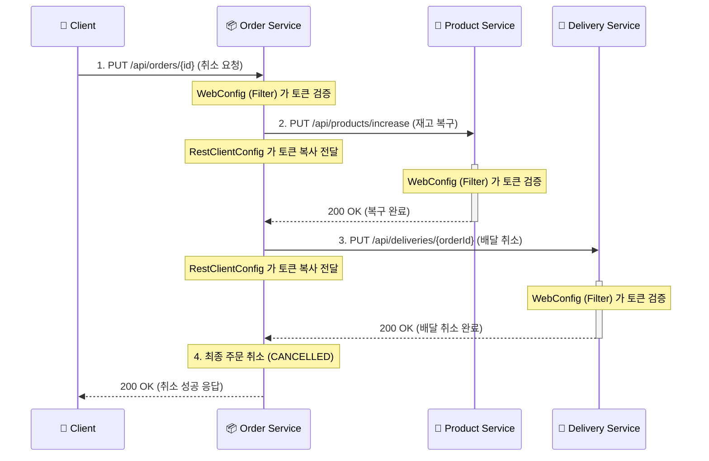

# 🔄 주문 취소 프로세스 (Order -> Product -> Delivery) 통합 분석 리포트

## 1. 전체 시스템 흐름도 (Sequence Diagram)



---

## 2. [STEP 1] Order Service 시작 (취소 진입)

### 🛡️ WebConfig & JwtAuthenticationFilter (Config 폴더)
*   **언제 작동하나?** 취소 요청이 컨트롤러에 도달하기 직전, 토큰의 유효성을 검사할 때 작동합니다.
*   **어떤 역할을 하나?** 헤더의 JWT를 검증하여 정당한 사용자인지 확인합니다.

### 🎮 OrderController.cancelOrder()
```java
@PutMapping("/{orderId}")
public ResponseEntity<?> cancelOrder(@PathVariable("orderId") int orderId) {
    // 1. @PathVariable: URL 경로에서 취소할 주문 ID를 추출함
    // 2. 서비스 계층으로 주문 취소 로직 위임
    return Resp.ok(orderService.cancelOrder(orderId));
}
```

---

## 3. [STEP 2] 서비스 간 통신 설정 (인증 유지)

### 📡 RestClientConfig (Config 폴더)
*   **언제 작동하나?** `Order Service`가 재고 복구와 배달 취소를 위해 외부 서비스를 호출할 때 작동합니다.
*   **어떤 역할을 하나?** 취소 요청을 보낸 사용자의 토큰을 `Product`와 `Delivery` 서비스에도 그대로 전달하여, 각 서비스가 "권한 있는 요청"임을 알게 합니다.

---

## 4. [STEP 3] 각 마이크로서비스 내부 동작

### 📦 OrderService.cancelOrder() (취소 오케스트레이터)
```java
@Transactional
public OrderResponse cancelOrder(int orderId) {
    // 1. DB에서 주문 존재 여부 확인
    Order findOrder = orderRepository.findById(orderId).orElseThrow(...);
    
    // 2. [멱등성 체크] 이미 취소된 주문인지 확인하여 중복 처리를 방지
    if (findOrder.getStatus() == OrderStatus.CANCELLED) {
        throw new Exception400("주문이 이미 취소되었습니다.");
    }
    
    // 3. 주문 아이템 목록 조회 (어떤 상품을 복구할지 확인)
    List<OrderItem> findOrderItems = orderItemRepository.findByOrderId(orderId).orElseThrow(...);
    
    // 4. [외부 호출] Product 서비스에 재고 복구(증가) 요청 - ProductClient 이용
    findOrderItems.forEach(item -> productClient.increaseQuantity(new ProductRequest(...)));
    
    // 5. [외부 호출] Delivery 서비스에 배달 취소 요청 - DeliveryClient 이용
    deliveryClient.cancelDelivery(orderId);
    
    // 6. 모든 외부 작업 성공 시 주문 상태를 CANCELLED로 변경
    findOrder.cancel();
    return OrderResponse.from(findOrder);
}
```

### 🍎 ProductService.increaseQuantity() (재고 복구)
```java
@Transactional
public ProductResponse increaseQuantity(int productId, int quantity, Long price) {
    // 1. 복구할 상품이 DB에 있는지 확인
    Product findProduct = productRepository.findById(productId).orElseThrow(...);
    
    // 2. [검증] 요청된 가격이 현재 DB 가격과 일치하는지 확인 (데이터 정합성)
    if (!price.equals(findProduct.getPrice())) {
        throw new Exception400("상품 가격이 일치하지 않습니다.");
    }
    
    // 3. 재고 증가 실행 (Dirty Checking으로 자동 반영)
    findProduct.increaseQuantity(quantity);
    return ProductResponse.from(findProduct);
}
```

### 🚚 DeliveryService.cancelDelivery() (배달 취소)
```java
@Transactional
public DeliveryResponse cancelDelivery(int orderId) {
    // 1. 해당 주문 번호에 연결된 배달 정보 조회
    Delivery findDelivery = deliveryRepository.findByOrderId(orderId).orElseThrow(...);
    
    // 2. [멱등성 체크] 배달이 이미 취소 상태인지 확인
    if(findDelivery.getStatus() == DeliveryStatus.CANCELLED) {
        throw new Exception400("배달이 이미 취소되었습니다.");
    }
    
    // 3. 배달 상태를 CANCELLED로 변경
    findDelivery.cancel();
    return DeliveryResponse.from(findDelivery);
}
```

---

## 💡 주문 취소 플로우 핵심 개념 정리

1.  **멱등성 (Idempotency)**: 같은 요청을 여러 번 보내도 결과가 같아야 합니다. 취소 요청이 두 번 들어와도 첫 번째에만 처리하고 두 번째는 "이미 취소됨" 에러를 던져 시스템의 안정성을 유지합니다.
2.  **역트랜잭션 (Inverse Transaction)**: 주문 생성 시 했던 작업(재고 차감)을 정확히 반대로 수행(재고 복구)하여 시스템을 이전 상태로 되돌리는 과정입니다.
3.  **서비스 간 데이터 정합성**: `Order`의 상태만 바꾸는 게 아니라, `Product`의 재고와 `Delivery`의 상태까지 모두 일관되게 업데이트하는 것이 MSA 취소 로직의 핵심입니다.
4.  **분산 환경의 보안**: `RestClientConfig`를 통한 인증 전파 덕분에, `Product`와 `Delivery` 서비스는 별도의 로그인 과정 없이도 `Order` 서비스의 요청이 유효한 사용자의 요청임을 신뢰할 수 있습니다.
