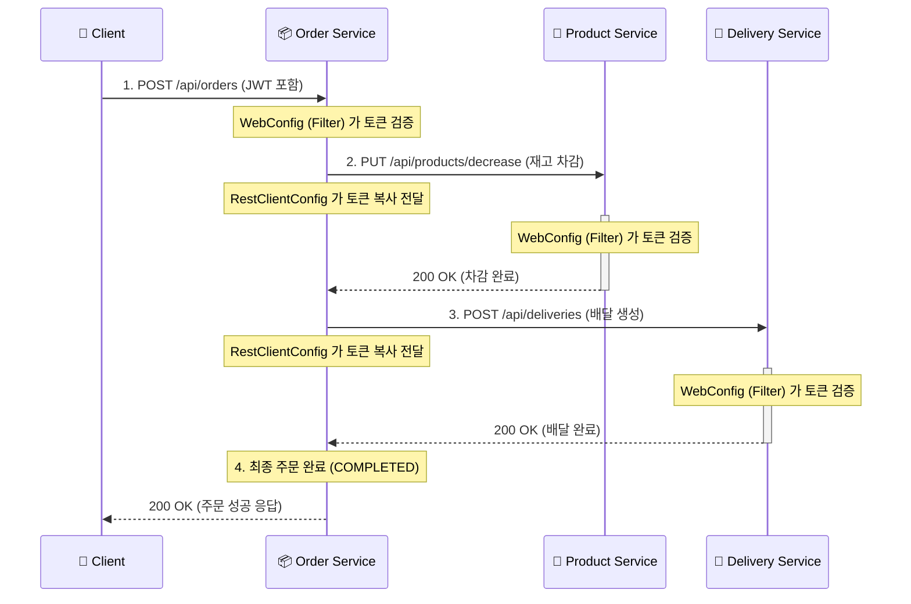

# 🛒 주문 생성 프로세스 (Order -> Product -> Delivery) 통합 분석 리포트

## 1. 전체 시스템 흐름도 (Sequence Diagram)



---

## 2. [STEP 1] Order Service 시작 (진입점)

### 🛡️ WebConfig & JwtAuthenticationFilter (Config 폴더)

- **언제 작동하나?** 클라이언트의 HTTP 요청이 컨트롤러에 도달하기 **직전**에 작동합니다.
- **어떤 역할을 하나?** 헤더의 토큰이 유효한지 검사하고, 유효하다면 `userId`를 꺼내 요청 객체(`request`)에 저장합니다.

```java
// WebConfig.java - 필터 등록 설정
registrationBean.setFilter(jwtAuthenticationFilter);
registrationBean.addUrlPatterns("/api/*"); // /api/로 시작하는 모든 요청 검사!
```

### 🎮 OrderController.createOrder()

```java
@PostMapping
public ResponseEntity<?> createOrder(@RequestBody OrderRequest requestDTO,
                                   @RequestAttribute("userId") Integer userId) {
    // 1. @RequestAttribute: 필터가 토큰에서 꺼내준 userId를 안전하게 가져옴
    // 2. 서비스 계층으로 핵심 비즈니스 로직 위임
    return Resp.ok(orderService.createOrder(userId, requestDTO.orderItems(), requestDTO.address()));
}
```

---

## 3. [STEP 2] 서비스 간 통신 준비 (중요 설정)

### 📡 RestClientConfig (Config 폴더)

- **언제 작동하나?** `Order Service`가 `Product`나 `Delivery` 서비스를 호출하려고 할 때 작동합니다.
- **어떤 역할을 하나?** 현재 사용자가 보낸 토큰을 **가로채서(Interceptor)** 외부로 나가는 요청 헤더에 똑같이 넣어줍니다. (Token Relay)

```java
// RestClientConfig.java - 인터셉터 로직
@Bean
    public RestClient.Builder restClientBuilder() {
        ClientHttpRequestInterceptor authForwardingInterceptor = (request, body, execution) -> {
            // 1. 현재 이 서비스를 호출한 클라이언트의 요청 정보를 가져옴
            ServletRequestAttributes attributes = (ServletRequestAttributes) RequestContextHolder
                    .getRequestAttributes();
            if (attributes != null) {
                // 2. 현재 요청의 헤더에서 "Authorization" (JWT 토큰)을 꺼냄
                String authorization = attributes.getRequest().getHeader("Authorization");
                if (authorization != null) {
                    // 3. 다른 서비스로 보낼 새로운 요청 헤더에 이 토큰을 똑같이 넣어줌 (인증 전파)
                    request.getHeaders().add("Authorization", authorization);
                }
            }
            return execution.execute(request, body);
        };

        return RestClient.builder().requestInterceptor(authForwardingInterceptor);
    }
```

---

## 4. [STEP 3] 각 마이크로서비스 내부 동작

### 📦 OrderService.createOrder() (오케스트레이터)

```java
@Transactional
public OrderResponse createOrder(int userId, List<OrderItemDTO> items, String address) {
    boolean productDecreased = false; // 보상 트랜잭션용 체크 변수
    try {
        // 1. 주문 데이터를 PENDING 상태로 DB에 먼저 저장
        Order createdOrder = orderRepository.save(Order.create(userId));

        // 2. 상품 서비스 호출 (재고 차감) - ProductClient 이용
        items.forEach(item -> productClient.decreaseQuantity(new ProductRequest(...)));
        productDecreased = true; // 재고 차감 성공 기록

        // 3. 배달 서비스 호출 (배달 생성) - DeliveryClient 이용
        deliveryClient.createDelivery(new DeliveryRequest(...));

        // 4. 모든 외부 서비스가 성공하면 상태를 COMPLETED로 변경
        createdOrder.complete();
        return OrderResponse.from(createdOrder, ...);
    } catch (Exception e) {
        // [중요] 배달이 실패하면 이미 차감된 재고를 다시 늘려줌 (보상 로직)
        if (productDecreased) productClient.increaseQuantity(...);
        throw new Exception500("주문 처리 실패");
    }
}
```

### 🍎 ProductService.decreaseQuantity() (재고 관리)

```java
@Transactional
public ProductResponse decreaseQuantity(int productId, int quantity, Long price) {
    // 1. 상품 존재 확인
    Product findProduct = productRepository.findById(productId).orElseThrow(...);

    // 2. 재고 확인: 주문 수량보다 남아있는 재고가 적으면 에러 반환
    if (findProduct.getQuantity() < quantity) throw new Exception400("재고 부족");

    // 3. 가격 확인: 사용자가 본 가격과 실제 DB 가격이 다르면 에러 반환
    if (!price.equals(findProduct.getPrice())) throw new Exception400("가격 변동 발생");

    // 4. 재고 차감 실행 (Dirty Checking으로 자동 업데이트)
    findProduct.decreaseQuantity(quantity);
    return ProductResponse.from(findProduct);
}
```

### 🚚 DeliveryService.createDelivery() (배달 실행)

```java
@Transactional
public DeliveryResponse createDelivery(int orderId, String address) {
    // 1. 새로운 배달 데이터를 DB에 저장 (초기 상태 생성)
    Delivery createdDelivery = deliveryRepository.save(Delivery.create(orderId, address));

    // 2. 주소가 비어있는지 마지막으로 한 번 더 체크
    if (address == null || address.isBlank()) throw new Exception400("주소 없음");

    // 3. 배달 프로세스 시작 상태로 변경
    createdDelivery.complete();
    return DeliveryResponse.from(createdDelivery);
}
```

---

## 💡 MSA 플로우 핵심 개념 정리

1.  **분산 트랜잭션과 보상 트랜잭션**: 여러 서비스의 DB를 동시에 수정할 수 없으므로(분산 환경), 한 곳이 실패하면 코드로 직접 이전 작업을 취소하는 '보상 트랜잭션' 로직이 필수입니다.
2.  **인증 전파 (Token Relay)**: 사용자의 신분증(JWT)은 서비스 간 통신 시에도 계속 유지되어야 합니다. 이를 위해 `RestClientConfig`의 인터셉터가 필요합니다.
3.  **서비스 디스커버리 (Service Name)**: `http://product-service:8082` 처럼 IP 대신 서비스 이름을 쓰는 이유는 도커가 동적으로 변하는 IP를 이름으로 관리해주기 때문입니다.
4.  **최종 일관성 (Eventual Consistency)**: 주문이 생성되는 찰나에는 재고만 깎이고 배달은 아직 안 만들어졌을 수 있습니다. 하지만 결국 모든 서비스가 성공하거나, 다 같이 취소되어 일관된 상태가 됩니다.
