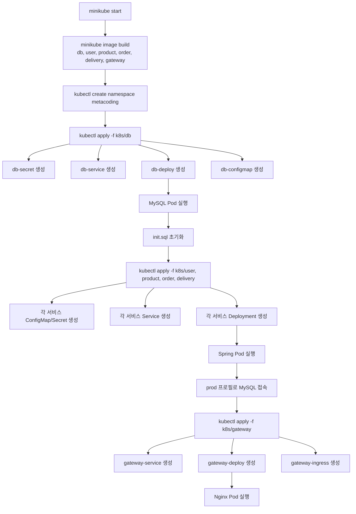
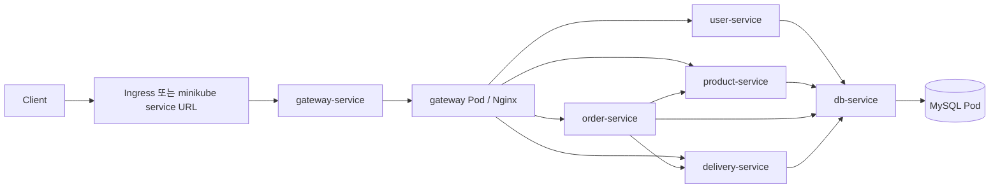
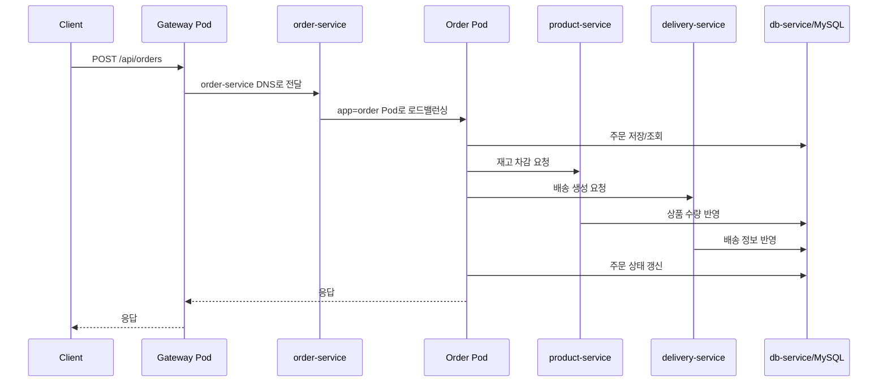

# Kubernetes YAML 실행 흐름 학습 정리

작성일: 2026-04-10

이 문서는 `MSA_STUDY_REPORT.md`, `README.md`, `k8s/**/*.yml`, `gateway/nginx.conf`, `db/Dockerfile`, `db/init.sql`을 기준으로 정리한 쿠버네티스 배포 학습 노트다.

목표는 아래 두 가지다.

1. `k8s` 안의 YAML이 "언제, 어떤 순서 감각으로, 어떻게 적용되는지" 이해하기
2. 각 YAML 내부 코드가 어떤 역할을 하는지 대표 파일 기준으로 이해하기

---

## 1. 먼저 큰 그림

이 프로젝트의 쿠버네티스 리소스는 크게 5종류다.

| 종류 | 역할 | 이 프로젝트에서 하는 일 |
|---|---|---|
| `ConfigMap` | 일반 설정 저장 | DB URL, JDBC Driver 같은 비민감 설정 전달 |
| `Secret` | 민감 정보 저장 | DB 계정, 비밀번호, JWT 설정 전달 |
| `Deployment` | Pod 생성/유지 | DB, Spring 서비스, Gateway 컨테이너 실행 |
| `Service` | Pod에 고정 이름 부여 | `user-service`, `order-service`, `db-service` 같은 내부 DNS 제공 |
| `Ingress` | 외부 진입 규칙 | 외부 요청을 `gateway-service`로 연결 |

핵심 포인트는 YAML이 "스크립트처럼 한 줄씩 실행"되는 것이 아니라, `kubectl apply`로 쿠버네티스 API 서버에 원하는 상태를 등록하면 각 컨트롤러가 그 상태를 맞춰 가는 구조라는 점이다.

즉, 실제 감각은 아래와 같다.

- `ConfigMap`, `Secret`: "이 설정을 저장해 둬"
- `Deployment`: "이 이미지 컨테이너를 이런 설정으로 1개 유지해 둬"
- `Service`: "이 라벨의 Pod들을 이 이름으로 묶어 둬"
- `Ingress`: "외부에서 들어오는 요청은 이 Service로 보내"

---

## 2. 실제 배포 흐름

### 2-1. 사람이 실행하는 순서

`README.md` 기준 실제 배포 절차는 아래 순서다.

1. `minikube start`
2. 각 서비스 이미지를 `minikube image build`로 빌드
3. `kubectl create namespace metacoding`
4. `kubectl apply -f k8s/db`
5. `kubectl apply -f k8s/order`
6. `kubectl apply -f k8s/product`
7. `kubectl apply -f k8s/user`
8. `kubectl apply -f k8s/delivery`
9. `kubectl apply -f k8s/gateway`

여기서 중요한 해석은 다음과 같다.

- 실무 감각상 `DB -> 앱 서비스들 -> Gateway` 순서가 가장 자연스럽다.
- 이유는 앱 서비스가 뜰 때 `db-service`와 DB 계정 정보가 이미 준비되어 있는 편이 안정적이기 때문이다.
- Gateway는 마지막에 열어 두는 편이 전체 흐름 이해에 좋다. Gateway가 먼저 떠도 큰 문제는 없지만, 뒤쪽 서비스가 아직 준비되지 않았으면 요청이 실패할 수 있다.

### 2-2. 디렉터리 내부 파일 순서는 절대적인가?

완전히 절대적이지는 않다.

`kubectl apply -f k8s/order`처럼 디렉터리 단위로 적용하면, 그 안의 여러 리소스가 API 서버에 등록된다.  
쿠버네티스는 선언형 시스템이라 "먼저 Service, 다음 Deployment" 같은 순서를 강하게 요구하지 않는다.

다만 런타임 관점에서는 의존성이 있다.

- `Deployment`가 만든 Pod는 `envFrom`으로 참조하는 `ConfigMap`, `Secret`이 있어야 정상 기동한다.
- `Service`는 먼저 생겨도 된다. 대상 Pod가 나중에 붙으면 된다.
- Spring 서비스 Pod는 먼저 떠도 되지만, DB가 안 뜨면 접속 실패로 재시작되거나 오류가 날 수 있다.

그래서 공부할 때는 "적용은 선언형, 기동은 의존성"이라고 기억하면 좋다.

### 2-3. 배포 흐름 머메이드



---

## 3. 런타임 요청 흐름

배포가 끝난 뒤 실제 요청 흐름은 아래처럼 본다.

### 3-1. 전체 요청 흐름



### 3-2. 주문 요청 기준 실제 체감 흐름



### 3-3. Ingress와 `minikube service`는 같은가?

같지 않다.

- `gateway-ingress.yml`은 "Ingress Controller가 있을 때" 외부 요청을 `gateway-service`로 보내는 규칙이다.
- 그런데 `README.md`의 실제 접근 방법은 `minikube service gateway-service -n metacoding --url`이다.
- 즉, 이 저장소의 기본 실습 흐름은 Ingress를 꼭 거치지 않아도 된다.

공부할 때는 이렇게 기억하면 좋다.

- Ingress: 정식 외부 진입 규칙
- `minikube service`: 로컬 실습용 우회 진입

즉, `gateway-ingress.yml`은 "외부 진입 규칙의 예시"이고, README의 실제 실행은 "Minikube가 Service URL을 임시로 열어 주는 방식"이다.

---

## 4. 중복 파일은 어떻게 묶어 보면 좋은가

`k8s` 폴더는 패턴 반복이 강하다. 그래서 공부할 때는 아래처럼 대표 파일만 이해하면 된다.

| 묶음 | 실제 파일 | 대표로 보면 되는 파일 | 공통 패턴 |
|---|---|---|---|
| 앱용 ConfigMap | `user-configmap.yml`, `product-configmap.yml`, `order-configmap.yml`, `delivery-configmap.yml` | `order-configmap.yml` | 이름만 다르고 구조는 사실상 동일 |
| 앱용 Secret(DB만) | `order-secret.yml`, `delivery-secret.yml` | `order-secret.yml` | DB 계정/비밀번호만 전달 |
| 앱용 Secret(DB+JWT) | `user-secret.yml`, `product-secret.yml` | `user-secret.yml` | DB 계정 + JWT 설정 전달 |
| 앱용 Deployment | `user-deploy.yml`, `product-deploy.yml`, `order-deploy.yml`, `delivery-deploy.yml` | `order-deploy.yml` | 포트, 이미지, 이름만 다르고 구조가 거의 동일 |
| 앱용 Service | `user-service.yml`, `product-service.yml`, `order-service.yml`, `delivery-service.yml` | `order-service.yml` | `ClusterIP + selector + port` 패턴 동일 |
| DB 전용 리소스 | `db-secret.yml`, `db-deployment.yml`, `db-service.yml`, `db-configmap.yml` | 각각 따로 봐야 함 | MySQL 초기화와 접속 기반 제공 |
| Gateway 전용 리소스 | `gateway-deploy.yml`, `gateway-service.yml`, `gateway-ingress.yml` | 각각 따로 봐야 함 | Nginx 실행과 외부 진입 연결 담당 |

---

## 5. 대표 YAML별 상세 해설

### 5-1. `db-secret.yml`

```yaml
apiVersion: v1
kind: Secret
metadata:
  name: db-secret
  namespace: metacoding
type: Opaque
stringData:
  MYSQL_ROOT_PASSWORD: root1234
  MYSQL_DATABASE: metadb
  MYSQL_USER: metacoding
  MYSQL_PASSWORD: metacoding1234
```

| 항목 | 의미 | 언제 사용되나 |
|---|---|---|
| `apiVersion: v1` | 기본 리소스 API 버전 | Secret 생성 시 |
| `kind: Secret` | 민감 정보 저장 리소스 | 쿠버네티스가 비밀값으로 관리 |
| `metadata.name` | 리소스 이름 | Deployment에서 `secretRef`로 참조 |
| `metadata.namespace` | `metacoding` 네임스페이스 소속 | 같은 네임스페이스 리소스끼리 연결 |
| `type: Opaque` | 일반 키-값 Secret | 특별한 인증서 형식이 아닌 일반 비밀값 |
| `stringData.*` | 사람이 읽기 쉬운 원문 문자열 | 저장 시 내부적으로 인코딩되어 Secret 데이터가 됨 |

이 파일의 역할은 "MySQL 컨테이너가 처음 뜰 때 필요한 초기 계정과 DB 이름"을 주는 것이다.

이 값들은 `db-deployment.yml`의 `envFrom.secretRef.name: db-secret`로 한 번에 주입된다.

---

### 5-2. `db-deployment.yml`

```yaml
apiVersion: apps/v1
kind: Deployment
metadata:
  name: db-deploy
  namespace: metacoding
spec:
  replicas: 1
  selector:
    matchLabels:
      app: db
  template:
    metadata:
      labels:
        app: db
    spec:
      containers:
        - name: db-server
          image: metacoding/db:1
          ports:
            - containerPort: 3306
          envFrom:
            - secretRef:
                name: db-secret
```

| 항목 | 의미 | 런타임 영향 |
|---|---|---|
| `kind: Deployment` | Pod를 원하는 개수로 유지 | MySQL Pod가 죽으면 다시 생성 |
| `replicas: 1` | DB Pod 1개 유지 | 단일 DB 실습 환경 |
| `selector.matchLabels.app: db` | 이 Deployment가 관리할 Pod 식별 | Pod 라벨과 꼭 맞아야 함 |
| `template.metadata.labels.app: db` | 실제 생성될 Pod 라벨 | `db-service`가 이 라벨로 Pod를 찾음 |
| `containers[].image` | 사용할 이미지 | `db/Dockerfile`로 만든 MySQL 이미지 |
| `containerPort: 3306` | 컨테이너 내부 포트 | Service가 연결할 대상 포트 |
| `envFrom.secretRef` | Secret의 키를 환경변수로 주입 | MySQL 엔트리포인트가 초기 계정 생성에 사용 |

실행 시점 해석:

1. `kubectl apply`로 Deployment가 등록된다.
2. Deployment Controller가 ReplicaSet을 만든다.
3. ReplicaSet이 MySQL Pod를 만든다.
4. 컨테이너 시작 시 `db-secret` 값이 환경변수로 들어간다.
5. MySQL 공식 이미지 엔트리포인트가 이 값을 읽고 DB를 초기화한다.

추가로 이 프로젝트는 `db/Dockerfile`에서 `init.sql`을 `/docker-entrypoint-initdb.d`에 복사한다.  
그래서 "빈 데이터 디렉터리로 처음 뜬 MySQL 컨테이너"일 때 테이블 생성과 더미 데이터 삽입이 자동 실행된다.

중요한 공부 포인트:

- 이 Deployment에는 `PersistentVolume`이 없다.
- 따라서 DB Pod가 새로 만들어지면 기존 데이터가 유지되지 않을 수 있다.
- 실습용으로는 단순하지만, 운영용으로는 휘발성 DB 구조다.

---

### 5-3. `db-service.yml`

```yaml
apiVersion: v1
kind: Service
metadata:
  name: db-service
  namespace: metacoding
spec:
  type: ClusterIP
  selector:
    app: db
  ports:
    - port: 3306
      targetPort: 3306
```

| 항목 | 의미 | 왜 필요한가 |
|---|---|---|
| `kind: Service` | Pod 앞의 고정 진입점 | DB Pod 이름이 바뀌어도 안정적으로 접근 가능 |
| `type: ClusterIP` | 클러스터 내부 전용 IP | 외부 공개 없이 내부 서비스만 접근 |
| `selector.app: db` | `app=db` Pod를 뒤에 연결 | DB Pod와 매칭 |
| `port: 3306` | Service가 제공하는 포트 | 앱이 `db-service:3306`으로 접속 |
| `targetPort: 3306` | 실제 Pod 포트 | MySQL 컨테이너 포트와 연결 |

이 파일이 있기 때문에 Spring 서비스는 "DB Pod의 실제 이름"을 몰라도 된다.  
그냥 `db-service:3306`으로 접속하면 된다.

---

### 5-4. 대표 앱 ConfigMap: `order-configmap.yml`

```yaml
apiVersion: v1
kind: ConfigMap
metadata:
  name: order-configmap
  namespace: metacoding
data:
  DB_URL: jdbc:mysql://db-service:3306/metadb?useSSL=false&serverTimezone=UTC&useLegacyDatetimeCode=false&allowPublicKeyRetrieval=true
  DB_DRIVER: com.mysql.cj.jdbc.Driver
```

| 항목 | 의미 | 언제 사용되나 |
|---|---|---|
| `kind: ConfigMap` | 일반 설정 저장 | Pod 환경변수 주입용 |
| `name: order-configmap` | `order-deploy.yml`에서 참조 | 해당 앱 Pod 기동 시 |
| `DB_URL` | MySQL 접속 문자열 | `application-prod.properties`의 `${DB_URL}`에 주입 |
| `DB_DRIVER` | JDBC 드라이버 클래스명 | `${DB_DRIVER}`에 주입 |

이 패턴은 `user`, `product`, `order`, `delivery` 모두 사실상 동일하다.  
차이는 파일 이름뿐이고, 내용은 모두 같은 DB를 바라본다는 점이다.

공부 포인트:

- `db-configmap.yml`도 같은 DB 설정을 담고 있지만, 실제로 MySQL 컨테이너는 JDBC URL이 필요 없다.
- 즉, `db-configmap.yml`은 DB 자신보다 "앱들이 참고하는 공용 DB 설정" 성격에 더 가깝다.
- 폴더는 `k8s/db` 아래에 있지만, 의미상으로는 앱들이 사용할 공통 설정이라고 보는 편이 더 자연스럽다.

---

### 5-5. 대표 앱 Secret: `user-secret.yml`

```yaml
apiVersion: v1
kind: Secret
metadata:
  name: user-secret
  namespace: metacoding
type: Opaque
stringData:
  DB_USERNAME: metacoding
  DB_PASSWORD: metacoding1234
  JWT_SECRET: mySecretKeyForJWTTokenGenerationThatShouldBeAtLeast256BitsLongForHS256Algorithm
  JWT_EXPIRATION: "86400000"
```

| 항목 | 의미 | 언제 사용되나 |
|---|---|---|
| `DB_USERNAME` | DB 접속 계정 | Spring datasource 초기화 시 |
| `DB_PASSWORD` | DB 접속 비밀번호 | Spring datasource 초기화 시 |
| `JWT_SECRET` | JWT 서명 키 | 로그인 토큰 생성/검증 시 |
| `JWT_EXPIRATION` | 만료 시간(ms) | JWT 생성 시 |

`user-secret.yml`과 `product-secret.yml`은 DB 계정 외에 JWT 설정도 넣는다.

반면 `order-secret.yml`, `delivery-secret.yml`은 DB 계정만 넣는다.  
그 이유는 `application-prod.properties`에서 JWT 값에 기본값을 넣어 두었기 때문이다.

즉, 이 프로젝트는 두 가지 방식이 공존한다.

- `user`, `product`: JWT 값을 Secret으로 명시 주입
- `order`, `delivery`: JWT 값을 YAML에서 안 주고 애플리케이션 기본값 사용

공부 관점에서는 "같은 기능이라도 환경변수 주입과 기본값 fallback을 함께 볼 수 있다"는 점이 포인트다.

---

### 5-6. 대표 앱 Deployment: `order-deploy.yml`

```yaml
apiVersion: apps/v1
kind: Deployment
metadata:
  name: order-deploy
  namespace: metacoding
spec:
  replicas: 1
  selector:
    matchLabels:
      app: order
  template:
    metadata:
      labels:
        app: order
    spec:
      containers:
        - name: order-server
          image: metacoding/order:1
          ports:
            - containerPort: 8081
          env:
            - name: SPRING_PROFILES_ACTIVE
              value: "prod"
          envFrom:
            - configMapRef:
                name: order-configmap
            - secretRef:
                name: order-secret
```

| 항목 | 의미 | 런타임 영향 |
|---|---|---|
| `replicas: 1` | 주문 서비스 Pod 1개 유지 | 단일 인스턴스 실습 |
| `selector.matchLabels.app: order` | Deployment 관리 대상 라벨 | Service와 연결의 기준 |
| `template.metadata.labels.app: order` | 생성될 Pod 라벨 | `order-service`가 이 Pod를 찾음 |
| `image: metacoding/order:1` | 실행할 컨테이너 이미지 | `order` 서비스 JAR 실행 |
| `containerPort: 8081` | 컨테이너 내부 포트 | Service가 연결 |
| `env: SPRING_PROFILES_ACTIVE=prod` | Spring prod 프로필 강제 사용 | H2 대신 MySQL 설정 사용 |
| `envFrom.configMapRef` | 비민감 설정 일괄 주입 | `DB_URL`, `DB_DRIVER` 공급 |
| `envFrom.secretRef` | 민감 정보 일괄 주입 | `DB_USERNAME`, `DB_PASSWORD` 공급 |

실행 시점 해석:

1. Deployment가 등록된다.
2. Pod가 생성된다.
3. 컨테이너 시작 전에 `ConfigMap`, `Secret` 값이 환경변수로 주입된다.
4. Spring Boot가 `SPRING_PROFILES_ACTIVE=prod`를 보고 `application-prod.properties`를 읽는다.
5. `${DB_URL}`, `${DB_DRIVER}`, `${DB_USERNAME}`, `${DB_PASSWORD}`를 환경변수에서 치환한다.
6. 결과적으로 `db-service:3306/metadb`로 접속한다.

이 패턴은 `user`, `product`, `delivery`도 거의 동일하다.  
차이는 이미지명, Pod 라벨, 포트, 참조하는 ConfigMap/Secret 이름 정도다.

---

### 5-7. 대표 앱 Service: `order-service.yml`

```yaml
apiVersion: v1
kind: Service
metadata:
  name: order-service
  namespace: metacoding
spec:
  type: ClusterIP
  selector:
    app: order
  ports:
    - port: 8081
      targetPort: 8081
```

| 항목 | 의미 | 역할 |
|---|---|---|
| `name: order-service` | 서비스 DNS 이름 | Gateway가 `order-service`로 호출 |
| `type: ClusterIP` | 내부 통신 전용 | 외부에 직접 열지 않음 |
| `selector.app: order` | 뒤에 붙일 Pod 선택 | `order` Pod와 매칭 |
| `port` | Service가 노출하는 포트 | 클러스터 내부 호출 포트 |
| `targetPort` | 실제 Pod 포트 | 컨테이너 8081로 전달 |

이 파일 덕분에 Gateway의 Nginx 설정은 아래처럼 쓸 수 있다.

```nginx
upstream order-service {
    server order-service:8081;
}
```

즉, Nginx는 Pod IP를 직접 모르는 대신 Service DNS 이름을 사용한다.

---

### 5-8. `gateway-deploy.yml`

```yaml
apiVersion: apps/v1
kind: Deployment
metadata:
  name: gateway-deploy
  namespace: metacoding
spec:
  replicas: 1
  selector:
    matchLabels:
      app: gateway
  template:
    metadata:
      labels:
        app: gateway
    spec:
      containers:
        - name: gateway-server
          image: metacoding/gateway:1
          ports:
            - containerPort: 80
```

이 Deployment는 Spring Boot가 아니라 Nginx 컨테이너를 띄운다.

핵심 연결 고리는 `gateway/Dockerfile`이다.

```dockerfile
FROM nginx:alpine
COPY nginx.conf /etc/nginx/nginx.conf
```

즉, `gateway-deploy.yml`은 단순히 Nginx 이미지를 띄우는 역할이고,  
실제 라우팅 규칙은 이미지 안에 복사된 `gateway/nginx.conf`가 담당한다.

`nginx.conf`의 의미를 같이 읽으면 아래 구조다.

| location | 실제 프록시 대상 |
|---|---|
| `/login` | `user-service:8083` |
| `/api/users` | `user-service:8083` |
| `/api/products` | `product-service:8082` |
| `/api/orders` | `order-service:8081` |
| `/api/deliveries` | `delivery-service:8084` |

즉, Gateway Deployment는 "입구 서버 실행", 라우팅 세부 규칙은 `nginx.conf` 담당이라고 나눠 보면 된다.

---

### 5-9. `gateway-service.yml`

```yaml
apiVersion: v1
kind: Service
metadata:
  name: gateway-service
  namespace: metacoding
spec:
  type: ClusterIP
  selector:
    app: gateway
  ports:
    - port: 80
      targetPort: 80
```

이 Service는 Gateway Pod에 붙는 대표 전화번호 역할이다.

외부에서 직접 Gateway Pod로 들어가는 것이 아니라, 보통 아래 둘 중 하나를 사용한다.

1. `gateway-ingress.yml`을 통한 Ingress 진입
2. `minikube service gateway-service --url`을 통한 로컬 진입

---

### 5-10. `gateway-ingress.yml`

```yaml
apiVersion: networking.k8s.io/v1
kind: Ingress
metadata:
  name: gateway-ingress
  namespace: metacoding
spec:
  rules:
    - http:
        paths:
          - path: /
            pathType: Prefix
            backend:
              service:
                name: gateway-service
                port:
                  number: 80
```

| 항목 | 의미 | 역할 |
|---|---|---|
| `kind: Ingress` | HTTP 외부 진입 규칙 | 외부 트래픽의 첫 관문 |
| `path: /` | 모든 경로 허용 | Gateway가 전체 경로를 다시 분기 |
| `pathType: Prefix` | `/`로 시작하는 모든 요청 포함 | 전체 API 경로 커버 |
| `backend.service.name` | 연결할 Service | `gateway-service` |
| `backend.service.port.number` | 연결 포트 | 80 |

이 Ingress는 "모든 외부 요청을 먼저 gateway-service로 보낸다"는 선언이다.  
그 다음 세부 경로 분기는 Nginx가 다시 처리한다.

즉, 역할 분담은 아래처럼 나뉜다.

- Ingress: 외부 -> Gateway 진입
- Gateway Nginx: Gateway -> 내부 서비스 분기

---

## 6. 파일들이 실제로 언제 쓰이는가

공부할 때 가장 헷갈리는 포인트를 "시점" 기준으로 다시 묶으면 아래와 같다.

| 시점 | 사용되는 파일 | 실제로 일어나는 일 |
|---|---|---|
| 이미지 빌드 시 | `db/Dockerfile`, `gateway/Dockerfile`, 각 서비스 Dockerfile | 컨테이너 이미지 안에 실행 환경과 설정 파일이 묶임 |
| `kubectl apply` 직후 | 모든 `*.yml` | 쿠버네티스 API 서버에 원하는 상태가 등록됨 |
| Pod 생성 직전 | `*-configmap.yml`, `*-secret.yml` | Deployment가 참조하는 환경변수 원천이 준비됨 |
| 컨테이너 시작 시 | `*-deploy.yml` | 실제 Pod/컨테이너가 실행됨 |
| Spring Boot 부팅 시 | `application-prod.properties` + 환경변수 | MySQL 접속 정보, JWT 설정이 치환됨 |
| 서비스 검색 시 | `*-service.yml` | DNS 이름으로 다른 Pod에 접근 가능해짐 |
| 외부 진입 시 | `gateway-service.yml`, `gateway-ingress.yml` | 외부 요청이 Gateway로 들어감 |
| Gateway 내부 분기 시 | `gateway/nginx.conf` | 경로별로 user/product/order/delivery에 프록시 |

---

## 7. 이 저장소에서 꼭 기억할 해석 포인트

### 7-1. `Service`는 앱을 실행하지 않는다

많이 헷갈리지만, `Service`는 컨테이너를 띄우지 않는다.  
실행은 `Deployment`가 하고, `Service`는 그 실행된 Pod를 찾는 이름표 역할이다.

### 7-2. `ConfigMap`과 `Secret`도 앱을 실행하지 않는다

이 둘은 단지 설정 창고다.  
실제 사용은 Deployment가 Pod를 만들 때 `envFrom`으로 가져갈 때 발생한다.

### 7-3. 앱 YAML은 거의 전부 같은 패턴이다

이 프로젝트는 학습용이라 `user`, `product`, `order`, `delivery`가 매우 유사하게 구성되어 있다.  
그래서 하나를 제대로 이해하면 나머지는 이름만 치환해서 읽어도 된다.

### 7-4. Ingress가 있어도 README 기본 실행은 Service URL 기반이다

즉, Ingress는 구조 이해용으로 중요하지만, 현재 저장소의 기본 실습은 `minikube service` 접근이 더 직접적이다.

### 7-5. DB는 공유 DB다

모든 서비스 ConfigMap이 같은 `db-service:3306/metadb`를 바라본다.  
즉, 서비스는 분리되어 있지만 데이터 저장소는 하나를 공유한다.

### 7-6. DB는 영속 저장소가 없다

`db-deployment.yml`에 볼륨 설정이 없으므로 DB Pod가 교체되면 데이터가 사라질 수 있다.  
새 Pod가 뜨면 이미지 안의 `init.sql`로 다시 초기화된다.

---

## 8. 공부용 한 줄 요약

이 프로젝트의 `k8s` YAML은 아래 한 문장으로 기억하면 된다.

`Secret/ConfigMap`이 설정을 준비하고, `Deployment`가 Pod를 띄우고, `Service`가 이름을 붙이고, `Ingress`와 `Gateway`가 외부 요청을 내부 서비스로 흘려보낸다.

조금 더 실감 나게 말하면 아래와 같다.

1. DB를 먼저 띄운다.
2. 각 Spring 서비스를 `prod` 프로필로 띄워 같은 MySQL에 붙인다.
3. Gateway Nginx를 띄워 경로별로 서비스를 나눈다.
4. 외부 요청은 Ingress 또는 Minikube Service URL로 Gateway에 들어온다.
5. 내부에서는 Service DNS 이름으로 서비스끼리 통신한다.
