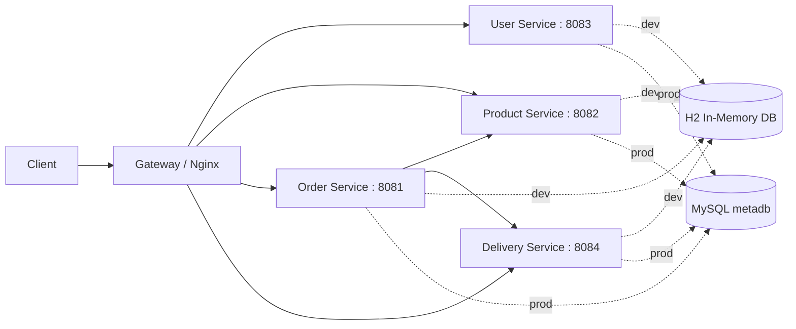
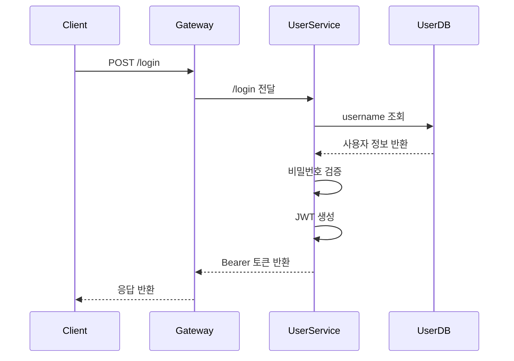
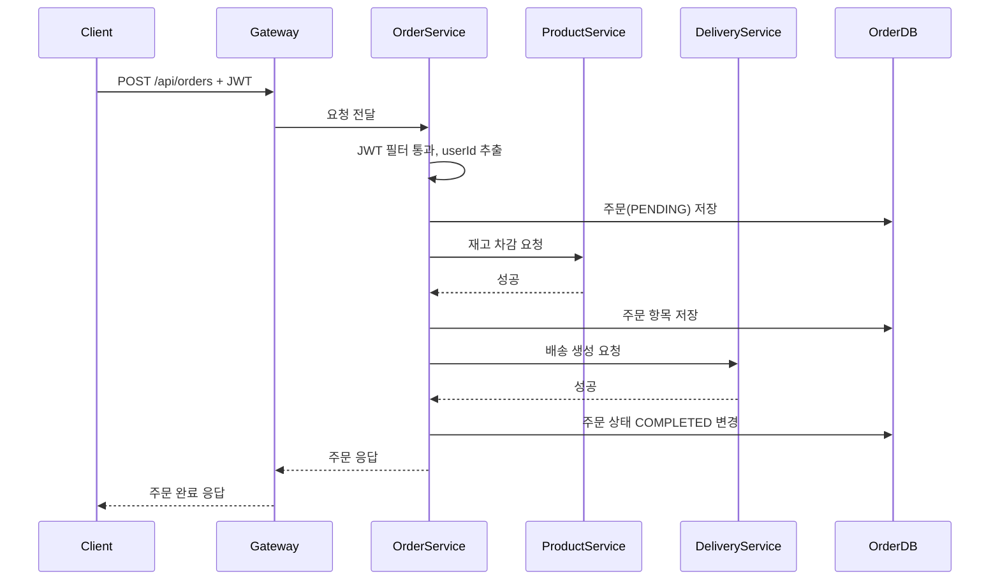
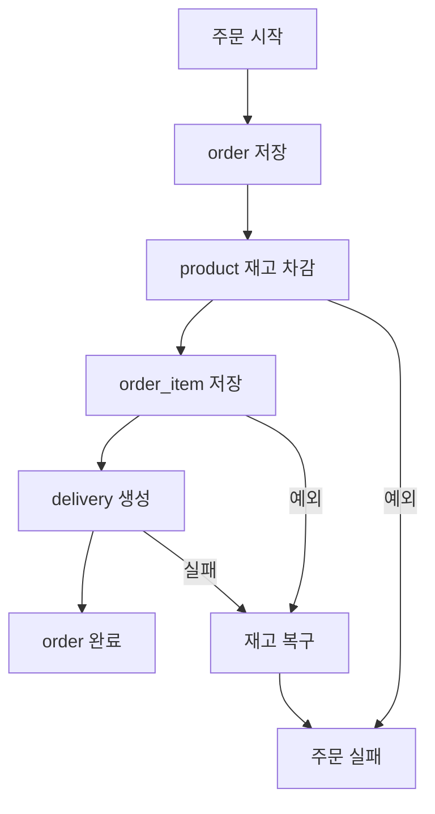

# MSA Lab Study Report

작성일: 2026-04-09

이 문서는 `chap02` 프로젝트 전체를 읽고 정리한 학습용 리포트다.
목표는 "코드를 처음 보는 사람도 전체 흐름을 이해할 수 있게" 만드는 것이다.

## 1. 한눈에 보는 프로젝트

이 프로젝트는 작은 쇼핑몰 주문 시스템을 MSA 스타일로 나눈 실습 프로젝트다.

- `user`: 로그인과 회원 조회를 담당한다.
- `product`: 상품 조회와 재고 증감을 담당한다.
- `order`: 주문 생성, 주문 조회, 주문 취소를 담당한다.
- `delivery`: 배송 생성, 배송 조회, 배송 취소를 담당한다.
- `gateway`: 바깥 요청을 받아 각 서비스로 전달하는 입구다.
- `db`: 운영 환경에서 사용할 MySQL 초기화 이미지를 만든다.
- `k8s`: 쿠버네티스에 배포하기 위한 YAML 모음이다.

핵심 포인트는 "하나의 큰 프로그램"이 아니라 "여러 개의 작은 프로그램"이 서로 HTTP로 대화한다는 점이다.

비유:
이 시스템은 백화점과 비슷하다.
정문 안내데스크는 `gateway`, 회원센터는 `user`, 상품창고는 `product`, 주문데스크는 `order`, 택배팀은 `delivery`다.
손님은 안내데스크만 보지만, 내부에서는 여러 부서가 협업해서 주문을 끝낸다.

## 2. 아키텍처 요약



중요:

- 개발(`dev`)에서는 각 서비스가 자기 메모리 안의 H2 DB를 따로 쓴다.
- 운영 실습(`prod`, Kubernetes)에서는 모든 서비스가 하나의 MySQL `metadb`를 같이 쓴다.
- 즉, "서비스는 분리"되어 있지만 "DB는 공유"하는 구조다.

이 점은 학습용으로는 이해하기 쉽지만, 엄격한 MSA 관점에서는 완전한 데이터 분리는 아니다.

## 3. 전체 실행 흐름

### 3-1. 로그인 흐름



### 3-2. 주문 생성 흐름



### 3-3. 주문 실패 시 보상 흐름



이 흐름은 분산 트랜잭션 대신 "보상 트랜잭션"을 흉내 낸 것이다.
쉽게 말해 한 번에 모두 되돌리는 마법 버튼이 없어서, 이미 한 일을 반대로 다시 호출해서 맞춘다.

비유:
주문 담당자가 창고에 "재고 빼주세요"라고 말한 뒤 택배팀 호출에 실패하면, 다시 창고에 "아까 뺀 거 원복해주세요"라고 전화하는 방식이다.

## 4. 화면처럼 보는 구조

```text
+-------------------------------------------------------------+
|                        Client / Postman                     |
+----------------------------+--------------------------------+
                             |
                             v
+-------------------------------------------------------------+
|                     Gateway (Nginx :80)                     |
|  /login -> user                                             |
|  /api/users -> user                                         |
|  /api/products -> product                                   |
|  /api/orders -> order                                       |
|  /api/deliveries -> delivery                                |
+-------------+---------------+---------------+---------------+
              |               |               |
              v               v               v
      +---------------+ +---------------+ +---------------+
      | user :8083    | | product :8082 | | order :8081   |
      | 로그인,회원조회 | | 상품,재고관리   | | 주문 오케스트라 |
      +---------------+ +---------------+ +-------+-------+
                                                  |
                                                  v
                                          +---------------+
                                          | delivery:8084 |
                                          | 배송 생성/취소 |
                                          +---------------+

개발 모드: 각 서비스가 자기 H2 사용
배포 모드: 모든 서비스가 MySQL metadb 공유
```

## 5. 서비스별 역할과 동작 시점

### 5-1. Gateway

역할:
외부에서 들어온 요청을 서비스별로 나눠 전달한다.

언제 동작하나:
클라이언트가 가장 먼저 만나는 지점이다.

어떻게 동작하나:
Nginx `location` 규칙으로 URL prefix에 따라 프록시한다.

비유:
건물 정문 안내원이다.
"로그인은 3층 회원팀, 상품은 4층 창고팀, 주문은 5층 주문팀"처럼 길만 안내한다.

### 5-2. User Service

역할:
로그인과 회원 조회.

언제 동작하나:

- `/login` 요청이 들어올 때
- `/api/users`, `/api/users/{id}` 요청이 들어올 때

어떻게 동작하나:

1. `UserController`가 요청을 받는다.
2. `UserService`가 저장소에서 유저를 찾는다.
3. 로그인일 경우 비밀번호를 검증한다.
4. 성공하면 JWT를 만든다.

비유:
회원증 발급 창구다.
본인 확인이 되면 출입증(JWT)을 준다.

### 5-3. Product Service

역할:
상품 조회, 재고 감소, 재고 증가.

언제 동작하나:

- 상품 목록/상세 조회 시
- 주문 생성으로 재고를 깎을 때
- 주문 취소나 보상 처리로 재고를 복구할 때

어떻게 동작하나:

1. 상품을 찾는다.
2. 재고와 가격을 검증한다.
3. 수량을 변경한다.

비유:
창고 관리자다.
주문서에 적힌 수량과 가격이 맞는지 확인하고 창고 수량을 바꾼다.

### 5-4. Order Service

역할:
주문 시스템의 중심.
주문 생성, 조회, 취소를 담당한다.

언제 동작하나:

- 주문 생성 `POST /api/orders`
- 주문 조회 `GET /api/orders/{orderId}`
- 주문 취소 `PUT /api/orders/{orderId}`

어떻게 동작하나:

1. JWT에서 `userId`를 읽는다.
2. 주문을 먼저 `PENDING`으로 저장한다.
3. Product 서비스에 재고 차감을 요청한다.
4. 주문 항목을 저장한다.
5. Delivery 서비스에 배송 생성을 요청한다.
6. 모두 성공하면 주문을 `COMPLETED`로 바꾼다.
7. 중간에 실패하면 배송 취소/재고 복구를 시도한다.

비유:
총괄 매니저다.
창고와 택배팀을 순서대로 불러 일감을 배분하고, 실패하면 뒤처리를 한다.

### 5-5. Delivery Service

역할:
배송 생성, 조회, 취소.

언제 동작하나:

- 주문이 생성될 때 배송 레코드를 만든다.
- 주문이 취소될 때 배송도 취소한다.

어떻게 동작하나:

1. 배송 엔티티를 만든다.
2. 주소를 검증한다.
3. 배송 상태를 `COMPLETED`로 바꾼다.

참고:
코드상 주소 검증이 저장 뒤에 실행된다.
학습 관점에서는 "검증은 보통 저장 전에 하는 것이 더 자연스럽다"는 점을 같이 기억하면 좋다.

비유:
택배 접수 직원이다.
주문 번호와 주소를 받아 배송 건을 만들고 상태를 갱신한다.

## 6. 요청이 서비스 안에서 흘러가는 공통 패턴

네 개의 Spring Boot 서비스는 거의 같은 뼈대를 공유한다.

### 공통 레이어

1. `Controller`
   HTTP 요청을 받는 입구.

2. `UseCase Interface`
   "이 서비스가 할 수 있는 일 목록".

3. `Service`
   실제 비즈니스 로직 담당.

4. `Repository`
   DB 접근 담당.

5. `Domain`
   핵심 데이터와 검증 규칙.

6. `DTO`
   API 입력/출력 전용 데이터 형식.

7. `core/filter`
   JWT 인증.

8. `core/handler`
   예외를 일정한 응답 형식으로 변환.

9. `core/util/Resp`
   응답 포맷 통일.

비유:

- `Controller`는 접수 창구
- `Service`는 실무 담당자
- `Repository`는 문서 보관실
- `Domain`은 업무 규정집
- `DTO`는 신청서 양식

## 7. 인증 방식 이해하기

이 프로젝트의 인증은 `JWT` 기반이다.

흐름:

1. 사용자가 `/login`으로 아이디/비밀번호를 보낸다.
2. `user` 서비스가 JWT를 만들어 `Bearer ...` 형태로 돌려준다.
3. 이후 `/api/*` 요청마다 `Authorization` 헤더에 토큰을 넣는다.
4. 각 서비스의 `JwtAuthenticationFilter`가 토큰을 검증한다.
5. 토큰이 유효하면 `userId`를 추출해 `request attribute`에 저장한다.
6. `order` 서비스는 이 `userId`를 사용해 주문 주인을 결정한다.

중요:

- `user`, `product`, `order`, `delivery` 모두 JWT 유틸과 필터를 개별적으로 갖고 있다.
- `order` 서비스는 다른 서비스 호출 시 `RestClientConfig`에서 원래 `Authorization` 헤더를 그대로 전달한다.

비유:
건물 출입증을 한 번 발급받으면, 각 부서 문 앞에서 그 출입증을 확인하는 방식이다.

## 8. 개발 모드와 배포 모드 차이

### 개발 모드

- 기본 활성 프로필은 `dev`
- 각 서비스는 H2 메모리 DB 사용
- 각 서비스마다 자기 `data.sql`을 읽음
- 그래서 서비스별로 독립적으로 빠르게 실습 가능

### 배포 모드

- Kubernetes에서 `SPRING_PROFILES_ACTIVE=prod`
- ConfigMap, Secret으로 DB 설정 주입
- 모든 서비스가 `db-service:3306/metadb` MySQL 공유
- 초기 테이블과 더미 데이터는 `db/init.sql`이 담당

이 차이는 매우 중요하다.
개발에서는 "각자 작은 연습장", 배포에서는 "하나의 공용 장부"를 쓰는 셈이다.

## 9. 이 프로젝트에서 꼭 알아야 할 개념

### 9-1. Reverse Proxy

`gateway/nginx.conf`는 요청을 뒤쪽 서비스로 전달한다.
프론트 문 하나만 열어두고, 내부 담당 부서로 안내하는 방식이다.

### 9-2. Service-to-Service Call

`order`는 `RestClient`로 `product`, `delivery`를 호출한다.
MSA에서는 서비스끼리 서로 함수를 직접 부르지 않고 네트워크 호출을 한다.

### 9-3. Compensation Transaction

하나의 DB 트랜잭션처럼 전부 묶을 수 없으니, 실패 시 "반대로 되돌리는 작업"을 따로 수행한다.
이 프로젝트의 주문 생성 실패 처리가 좋은 예다.

### 9-4. Shared Database

이 프로젝트는 배포 모드에서 모든 서비스가 하나의 MySQL을 공유한다.
실무 MSA에서는 보통 서비스별 데이터 소유권을 나누는 편이지만, 학습 단계에서는 구조를 이해하기 쉬워진다.

### 9-5. Filter

컨트롤러에 도달하기 전에 먼저 검사하는 문지기다.
여기서는 JWT 검사 담당이다.

### 9-6. DTO

외부와 주고받는 전용 상자다.
엔티티를 그대로 노출하지 않고 필요한 데이터만 포장한다.

### 9-7. ConfigMap / Secret

- ConfigMap: 일반 설정
- Secret: 비밀번호 같은 민감 정보

비유:

- ConfigMap은 공용 안내문
- Secret은 자물쇠 서랍

### 9-8. Deployment / Service / Ingress

- Deployment: 컨테이너를 몇 개 띄울지 관리
- Service: Pod를 고정 이름으로 접근하게 해줌
- Ingress: 외부 진입 규칙

비유:

- Deployment는 점장
- Service는 대표 전화번호
- Ingress는 건물 출입 안내판

## 10. 주요 API 정리

### Gateway 경유 공개 진입점

| Method | Path | 실제 대상 |
|---|---|---|
| `POST` | `/login` | `user-service` |
| `GET` | `/api/users` | `user-service` |
| `GET` | `/api/users/{userId}` | `user-service` |
| `GET` | `/api/products` | `product-service` |
| `GET` | `/api/products/{productId}` | `product-service` |
| `PUT` | `/api/products/{productId}/decrease` | `product-service` |
| `PUT` | `/api/products/{productId}/increase` | `product-service` |
| `POST` | `/api/orders` | `order-service` |
| `GET` | `/api/orders/{orderId}` | `order-service` |
| `PUT` | `/api/orders/{orderId}` | `order-service` |
| `POST` | `/api/deliveries` | `delivery-service` |
| `GET` | `/api/deliveries/{deliveryId}` | `delivery-service` |
| `PUT` | `/api/deliveries/{orderId}` | `delivery-service` |

### 예시 호출

#### 로그인

```http
POST /login
Content-Type: application/json

{
  "username": "ssar",
  "password": "1234"
}
```

#### 주문 생성

```http
POST /api/orders
Authorization: Bearer <token>
Content-Type: application/json

{
  "orderItems": [
    { "productId": 1, "quantity": 1, "price": 2500000 }
  ],
  "address": "Seoul"
}
```

## 11. 코드 읽기 추천 순서

초보자라면 아래 순서가 가장 덜 헷갈린다.

1. `gateway/nginx.conf`
2. `user` 로그인 흐름
3. `product` 재고 흐름
4. `order` 주문 생성 흐름
5. `delivery` 생성/취소 흐름
6. `db/init.sql`
7. `k8s/*`

이 순서가 좋은 이유:
먼저 "입구"를 보고, 그 다음 "출입증", 그 다음 "재고", 마지막으로 "총괄 주문"을 보면 머릿속에서 연결이 잘 된다.

## 12. 공부할 때 특별히 체크할 포인트

### 잘 만든 학습 포인트

- 서비스 책임이 비교적 분명하다.
- 모든 서비스가 비슷한 구조라 반복 학습에 좋다.
- JWT, Reverse Proxy, Kubernetes, ConfigMap, Secret, RestClient를 한 번에 볼 수 있다.
- 주문 생성에서 보상 트랜잭션 아이디어를 체험할 수 있다.

### 같이 생각해볼 한계

- 배포 모드에서 DB를 공유하므로 진짜 완전한 MSA와는 다르다.
- 서비스 간 호출이 동기식 HTTP라 장애 전파 가능성이 있다.
- 테스트가 `contextLoads()`뿐이라 비즈니스 검증 자동화는 거의 없다.
- 메시지 큐, 이벤트 기반 통신, 서킷 브레이커, 분산 추적은 없다.
- 배송 주소 검증이 저장 뒤에 수행된다.

이런 한계도 오히려 공부 포인트다.
"왜 실무에서는 여기서 더 복잡한 도구를 쓰는가?"를 이해하기 좋다.

## 13. 파일별 역할 정리

아래 표는 프로젝트의 주요 텍스트 파일을 기준으로 정리했다.
반복 패턴이 강한 표준 래퍼 파일도 포함했다.

### 13-1. 루트 / 공통

| 파일 | 역할 | 언제/어떻게 동작 |
|---|---|---|
| `README.md` | Minikube 기반 실습 절차 문서 | 이미지를 빌드하고 namespace 생성 후 `kubectl apply` 할 때 참고 |
| `.vscode/settings.json` | VS Code Java null analysis 설정 | IDE가 정적 분석할 때 사용 |
| `MSA_STUDY_REPORT.md` | 이 학습 리포트 | 사람이 공부할 때 읽음 |

### 13-2. DB

| 파일 | 역할 | 언제/어떻게 동작 |
|---|---|---|
| `db/Dockerfile` | MySQL 이미지 생성 | `minikube image build -t metacoding/db:1 ./db` 시 사용 |
| `db/init.sql` | 운영용 테이블과 더미 데이터 초기화 | MySQL 컨테이너 첫 실행 시 `/docker-entrypoint-initdb.d`로 자동 실행 |

### 13-3. Gateway

| 파일 | 역할 | 언제/어떻게 동작 |
|---|---|---|
| `gateway/Dockerfile` | Nginx 기반 게이트웨이 이미지 생성 | gateway 이미지를 빌드할 때 사용 |
| `gateway/nginx.conf` | URL별 서비스 라우팅 규칙 | gateway 컨테이너 시작 시 Nginx가 로드 |

### 13-4. Kubernetes - DB

| 파일 | 역할 | 언제/어떻게 동작 |
|---|---|---|
| `k8s/db/db-configmap.yml` | DB 접속 URL, 드라이버 설정 | DB를 참조하는 서비스 배포 시 환경변수 주입에 활용 |
| `k8s/db/db-deployment.yml` | MySQL Pod 배포 정의 | `kubectl apply -f k8s/db` 시 생성 |
| `k8s/db/db-secret.yml` | MySQL 계정/비밀번호 | DB 컨테이너 환경변수로 주입 |
| `k8s/db/db-service.yml` | `db-service` 내부 DNS 제공 | 다른 서비스가 `db-service:3306`으로 접속 |

### 13-5. Kubernetes - Gateway

| 파일 | 역할 | 언제/어떻게 동작 |
|---|---|---|
| `k8s/gateway/gateway-deploy.yml` | gateway Deployment | gateway Pod 실행 |
| `k8s/gateway/gateway-service.yml` | gateway ClusterIP Service | Ingress와 Minikube 서비스가 gateway에 연결 |
| `k8s/gateway/gateway-ingress.yml` | 외부 진입 규칙 | `/` 경로를 gateway-service로 연결 |

### 13-6. Kubernetes - User

| 파일 | 역할 | 언제/어떻게 동작 |
|---|---|---|
| `k8s/user/user-configmap.yml` | user 서비스 DB 설정 | user Pod 환경변수 주입 |
| `k8s/user/user-deploy.yml` | user Deployment | `SPRING_PROFILES_ACTIVE=prod`로 실행 |
| `k8s/user/user-secret.yml` | user DB 계정, JWT 비밀키 | user 컨테이너 환경변수로 주입 |
| `k8s/user/user-service.yml` | user-service 내부 주소 | gateway와 타 서비스가 DNS로 호출 |

### 13-7. Kubernetes - Product

| 파일 | 역할 | 언제/어떻게 동작 |
|---|---|---|
| `k8s/product/product-configmap.yml` | product 서비스 DB 설정 | product Pod 환경변수 주입 |
| `k8s/product/product-deploy.yml` | product Deployment | prod 프로필로 product 실행 |
| `k8s/product/product-secret.yml` | product DB 계정, JWT 설정 | product 컨테이너 환경변수로 주입 |
| `k8s/product/product-service.yml` | product-service 내부 주소 | gateway, order가 호출 |

### 13-8. Kubernetes - Order

| 파일 | 역할 | 언제/어떻게 동작 |
|---|---|---|
| `k8s/order/order-configmap.yml` | order 서비스 DB 설정 | order Pod 환경변수 주입 |
| `k8s/order/order-deploy.yml` | order Deployment | prod 프로필로 order 실행 |
| `k8s/order/order-secret.yml` | order DB 계정 | order 컨테이너 환경변수로 주입 |
| `k8s/order/order-service.yml` | order-service 내부 주소 | gateway가 주문 요청을 보냄 |

### 13-9. Kubernetes - Delivery

| 파일 | 역할 | 언제/어떻게 동작 |
|---|---|---|
| `k8s/delivery/delivery-configmap.yml` | delivery 서비스 DB 설정 | delivery Pod 환경변수 주입 |
| `k8s/delivery/delivery-deploy.yml` | delivery Deployment | prod 프로필로 delivery 실행 |
| `k8s/delivery/delivery-secret.yml` | delivery DB 계정 | delivery 컨테이너 환경변수로 주입 |
| `k8s/delivery/delivery-service.yml` | delivery-service 내부 주소 | gateway, order가 호출 |

### 13-10. User 서비스

#### 빌드/실행 파일

| 파일 | 역할 | 언제/어떻게 동작 |
|---|---|---|
| `user/build.gradle` | user 서비스 의존성 및 빌드 설정 | Gradle 빌드 시 사용 |
| `user/settings.gradle` | Gradle 루트 프로젝트명 정의 | Gradle 초기화 시 사용 |
| `user/Dockerfile` | user 서비스 JAR 빌드 후 실행 이미지 생성 | Docker/Minikube 이미지 빌드 시 사용 |
| `user/gradlew` | Unix 계열 Gradle wrapper 실행 스크립트 | `./gradlew` 실행 시 사용 |
| `user/gradlew.bat` | Windows Gradle wrapper 실행 스크립트 | `gradlew.bat` 실행 시 사용 |
| `user/gradle/wrapper/gradle-wrapper.properties` | Gradle 배포판 버전 정의 | wrapper가 Gradle 다운로드/실행할 때 사용 |
| `user/gradle/wrapper/gradle-wrapper.jar` | Gradle wrapper 바이너리 | `gradlew`가 내부적으로 실행 |

#### 설정/데이터/테스트 파일

| 파일 | 역할 | 언제/어떻게 동작 |
|---|---|---|
| `user/src/main/resources/application.properties` | 기본 활성 프로필을 `dev`로 지정 | 앱 부팅 시 가장 먼저 읽힘 |
| `user/src/main/resources/application-dev.properties` | H2, 포트 8083, JWT, `data.sql` 설정 | 개발 모드 실행 시 사용 |
| `user/src/main/resources/application-prod.properties` | MySQL 환경변수 기반 설정 | Kubernetes prod 실행 시 사용 |
| `user/src/main/resources/db/data.sql` | user 더미 데이터 | dev 모드 시작 시 H2에 입력 |
| `user/src/test/java/com/metacoding/user/UserApplicationTests.java` | 컨텍스트 로딩 테스트 | 테스트 실행 시 스프링 부팅 확인 |

#### 코드 파일

| 파일 | 역할 | 언제/어떻게 동작 |
|---|---|---|
| `user/src/main/java/com/metacoding/user/UserApplication.java` | user 서비스 시작점 | 애플리케이션 부팅 진입점 |
| `user/src/main/java/com/metacoding/user/web/UserController.java` | 로그인, 회원 조회 API 엔드포인트 | HTTP 요청 수신 시 동작 |
| `user/src/main/java/com/metacoding/user/web/dto/UserRequest.java` | 로그인 요청 DTO | `/login` 요청 본문 바인딩 |
| `user/src/main/java/com/metacoding/user/web/dto/UserResponse.java` | 회원 응답 DTO | 조회 결과 응답 생성 |
| `user/src/main/java/com/metacoding/user/usecase/LoginUseCase.java` | 로그인 기능 인터페이스 | 컨트롤러가 의존 |
| `user/src/main/java/com/metacoding/user/usecase/GetUserUseCase.java` | 단건 조회 인터페이스 | 컨트롤러가 의존 |
| `user/src/main/java/com/metacoding/user/usecase/GetAllUsersUseCase.java` | 목록 조회 인터페이스 | 컨트롤러가 의존 |
| `user/src/main/java/com/metacoding/user/usecase/UserService.java` | 로그인/JWT 생성, 회원 조회 로직 | 비즈니스 로직의 실제 구현 |
| `user/src/main/java/com/metacoding/user/domain/User.java` | 회원 엔티티와 비밀번호 검증 규칙 | JPA 매핑, 로그인 검증 시 사용 |
| `user/src/main/java/com/metacoding/user/repository/UserRepository.java` | 회원 DB 접근 | JPA가 구현체 생성 |
| `user/src/main/java/com/metacoding/user/core/config/WebConfig.java` | JWT 필터 등록 | 앱 부팅 시 필터 체인 설정 |
| `user/src/main/java/com/metacoding/user/core/filter/JwtAuthenticationFilter.java` | `/api/*` JWT 검사 | 컨트롤러 전에 실행 |
| `user/src/main/java/com/metacoding/user/core/util/JwtUtil.java` | JWT 생성/검증/파싱 | 로그인과 인증 필터에서 사용 |
| `user/src/main/java/com/metacoding/user/core/util/JwtProvider.java` | 요청에서 토큰 추출, userId 획득 | 필터가 호출 |
| `user/src/main/java/com/metacoding/user/core/util/Resp.java` | 공통 응답 포맷 | 컨트롤러/예외 처리에서 사용 |
| `user/src/main/java/com/metacoding/user/core/handler/GlobalExceptionHandler.java` | 예외를 HTTP 응답으로 변환 | 예외 발생 시 자동 동작 |
| `user/src/main/java/com/metacoding/user/core/handler/ex/Exception400.java` | 400 예외 타입 | 잘못된 요청 처리 |
| `user/src/main/java/com/metacoding/user/core/handler/ex/Exception401.java` | 401 예외 타입 | 인증 실패 처리 |
| `user/src/main/java/com/metacoding/user/core/handler/ex/Exception403.java` | 403 예외 타입 | 권한 거부 처리 |
| `user/src/main/java/com/metacoding/user/core/handler/ex/Exception404.java` | 404 예외 타입 | 데이터 없음 처리 |
| `user/src/main/java/com/metacoding/user/core/handler/ex/Exception500.java` | 500 예외 타입 | 서버 오류 처리 |

### 13-11. Product 서비스

#### 빌드/실행 파일

| 파일 | 역할 | 언제/어떻게 동작 |
|---|---|---|
| `product/build.gradle` | product 서비스 의존성 및 빌드 설정 | Gradle 빌드 시 사용 |
| `product/settings.gradle` | 프로젝트명 `product` 지정 | Gradle 초기화 시 사용 |
| `product/Dockerfile` | product 서비스 이미지 생성 | Docker 빌드 시 사용 |
| `product/gradlew` | Unix Gradle wrapper 스크립트 | `./gradlew` 실행 시 사용 |
| `product/gradlew.bat` | Windows Gradle wrapper 스크립트 | Windows 실행 시 사용 |
| `product/gradle/wrapper/gradle-wrapper.properties` | Gradle 8.14.4 wrapper 설정 | wrapper 실행 시 사용 |
| `product/gradle/wrapper/gradle-wrapper.jar` | Gradle wrapper 바이너리 | `gradlew` 내부 실행 |

#### 설정/데이터/테스트 파일

| 파일 | 역할 | 언제/어떻게 동작 |
|---|---|---|
| `product/src/main/resources/application.properties` | 기본 프로필 `dev` | 부팅 시 읽힘 |
| `product/src/main/resources/application-dev.properties` | H2, 포트 8082, JWT, 샘플 데이터 설정 | 개발 모드 실행 시 사용 |
| `product/src/main/resources/application-prod.properties` | MySQL 환경변수 기반 설정 | 배포 모드 실행 시 사용 |
| `product/src/main/resources/db/data.sql` | 상품 더미 데이터 | dev H2 초기화 시 사용 |
| `product/src/test/java/com/metacoding/product/ProductApplicationTests.java` | 컨텍스트 로딩 테스트 | 테스트 실행 시 사용 |

#### 코드 파일

| 파일 | 역할 | 언제/어떻게 동작 |
|---|---|---|
| `product/src/main/java/com/metacoding/product/ProductApplication.java` | product 서비스 시작점 | 애플리케이션 부팅 시 |
| `product/src/main/java/com/metacoding/product/web/ProductController.java` | 상품 조회/재고 변경 API | 요청 수신 시 동작 |
| `product/src/main/java/com/metacoding/product/web/dto/ProductRequest.java` | 재고 증감 요청 DTO | decrease/increase 요청 본문 매핑 |
| `product/src/main/java/com/metacoding/product/web/dto/ProductResponse.java` | 상품 응답 DTO | 조회 및 변경 응답 생성 |
| `product/src/main/java/com/metacoding/product/usecase/GetProductUseCase.java` | 상품 단건 조회 인터페이스 | 컨트롤러가 의존 |
| `product/src/main/java/com/metacoding/product/usecase/GetAllProductsUseCase.java` | 상품 목록 조회 인터페이스 | 컨트롤러가 의존 |
| `product/src/main/java/com/metacoding/product/usecase/DecreaseQuantityUseCase.java` | 재고 감소 인터페이스 | order가 주문 생성 시 간접 사용 |
| `product/src/main/java/com/metacoding/product/usecase/IncreaseQuantityUseCase.java` | 재고 증가 인터페이스 | 주문 취소/보상 시 사용 |
| `product/src/main/java/com/metacoding/product/usecase/ProductService.java` | 상품 조회, 재고/가격 검증, 재고 변경 로직 | 핵심 비즈니스 로직 |
| `product/src/main/java/com/metacoding/product/domain/Product.java` | 상품 엔티티, 재고/가격 검증 규칙 | JPA 매핑과 도메인 규칙 담당 |
| `product/src/main/java/com/metacoding/product/repository/ProductRepository.java` | 상품 DB 접근 | JPA Repository |
| `product/src/main/java/com/metacoding/product/core/config/WebConfig.java` | JWT 필터 등록 | 부팅 시 필터 설정 |
| `product/src/main/java/com/metacoding/product/core/filter/JwtAuthenticationFilter.java` | `/api/*` 토큰 검증 | 요청 전 실행 |
| `product/src/main/java/com/metacoding/product/core/util/JwtUtil.java` | JWT 생성/검증/파싱 | 필터와 공통 유틸 |
| `product/src/main/java/com/metacoding/product/core/util/JwtProvider.java` | 헤더 토큰 추출과 userId 해석 | 필터가 사용 |
| `product/src/main/java/com/metacoding/product/core/util/Resp.java` | 공통 응답 형식 | API 응답에 사용 |
| `product/src/main/java/com/metacoding/product/core/handler/GlobalExceptionHandler.java` | 예외 공통 처리 | 예외 발생 시 작동 |
| `product/src/main/java/com/metacoding/product/core/handler/ex/Exception400.java` | 400 예외 타입 | 검증 실패 시 사용 |
| `product/src/main/java/com/metacoding/product/core/handler/ex/Exception401.java` | 401 예외 타입 | 인증 실패 시 사용 |
| `product/src/main/java/com/metacoding/product/core/handler/ex/Exception403.java` | 403 예외 타입 | 권한 관련 오류 |
| `product/src/main/java/com/metacoding/product/core/handler/ex/Exception404.java` | 404 예외 타입 | 상품 없음 처리 |
| `product/src/main/java/com/metacoding/product/core/handler/ex/Exception500.java` | 500 예외 타입 | 서버 오류 처리 |

### 13-12. Order 서비스

#### 빌드/실행 파일

| 파일 | 역할 | 언제/어떻게 동작 |
|---|---|---|
| `order/build.gradle` | order 서비스 의존성 및 빌드 설정 | Gradle 빌드 시 사용 |
| `order/settings.gradle` | 프로젝트명 `order` 지정 | Gradle 초기화 시 사용 |
| `order/Dockerfile` | order 서비스 이미지 생성 | Docker 빌드 시 사용 |
| `order/gradlew` | Unix Gradle wrapper 스크립트 | `./gradlew` 실행 시 사용 |
| `order/gradlew.bat` | Windows Gradle wrapper 스크립트 | Windows 실행 시 사용 |
| `order/gradle/wrapper/gradle-wrapper.properties` | Gradle 9.3.0 wrapper 설정 | wrapper 실행 시 사용 |
| `order/gradle/wrapper/gradle-wrapper.jar` | Gradle wrapper 바이너리 | `gradlew` 내부 실행 |

#### 설정/데이터/테스트 파일

| 파일 | 역할 | 언제/어떻게 동작 |
|---|---|---|
| `order/src/main/resources/application.properties` | 기본 프로필 `dev` | 부팅 시 읽힘 |
| `order/src/main/resources/application-dev.properties` | H2, 포트 8081, JWT, 샘플 주문 설정 | 개발 모드 실행 시 사용 |
| `order/src/main/resources/application-prod.properties` | MySQL 환경변수 기반 설정 | Kubernetes prod 실행 시 사용 |
| `order/src/main/resources/db/data.sql` | 주문/주문항목 더미 데이터 | dev H2 초기화 시 사용 |
| `order/src/test/java/com/metacoding/order/OrderApplicationTests.java` | 컨텍스트 로딩 테스트 | 테스트 실행 시 사용 |

#### 코드 파일

| 파일 | 역할 | 언제/어떻게 동작 |
|---|---|---|
| `order/src/main/java/com/metacoding/order/OrderApplication.java` | order 서비스 시작점 | 애플리케이션 부팅 시 |
| `order/src/main/java/com/metacoding/order/web/OrderController.java` | 주문 생성/조회/취소 API | 요청 수신 시 동작 |
| `order/src/main/java/com/metacoding/order/web/dto/OrderRequest.java` | 주문 생성 요청 DTO | 주문 본문 매핑 |
| `order/src/main/java/com/metacoding/order/web/dto/OrderResponse.java` | 주문 응답 DTO | 주문 결과 반환 |
| `order/src/main/java/com/metacoding/order/usecase/CreateOrderUseCase.java` | 주문 생성 인터페이스 | 컨트롤러가 의존 |
| `order/src/main/java/com/metacoding/order/usecase/GetOrderUseCase.java` | 주문 조회 인터페이스 | 컨트롤러가 의존 |
| `order/src/main/java/com/metacoding/order/usecase/CancelOrderUseCase.java` | 주문 취소 인터페이스 | 컨트롤러가 의존 |
| `order/src/main/java/com/metacoding/order/usecase/OrderService.java` | 주문 오케스트레이션, 보상 처리, 조회/취소 로직 | 프로젝트 핵심 비즈니스 로직 |
| `order/src/main/java/com/metacoding/order/domain/Order.java` | 주문 엔티티와 상태 전환 규칙 | JPA 매핑, 주문 상태 관리 |
| `order/src/main/java/com/metacoding/order/domain/OrderItem.java` | 주문 항목 엔티티 | 주문 상세 저장 |
| `order/src/main/java/com/metacoding/order/domain/OrderStatus.java` | 주문 상태 enum | `PENDING`, `COMPLETED`, `CANCELLED` 표현 |
| `order/src/main/java/com/metacoding/order/repository/OrderRepository.java` | 주문 DB 접근 | JPA Repository |
| `order/src/main/java/com/metacoding/order/repository/OrderItemRepository.java` | 주문 항목 DB 접근 | 주문별 항목 조회/저장 |
| `order/src/main/java/com/metacoding/order/adapter/ProductClient.java` | product 서비스 HTTP 호출 | 주문 생성/취소 시 재고 조정 |
| `order/src/main/java/com/metacoding/order/adapter/DeliveryClient.java` | delivery 서비스 HTTP 호출 | 배송 생성/취소 요청 |
| `order/src/main/java/com/metacoding/order/adapter/dto/ProductRequest.java` | product 호출용 요청 DTO | 내부 서비스 호출 본문 |
| `order/src/main/java/com/metacoding/order/adapter/dto/DeliveryRequest.java` | delivery 호출용 요청 DTO | 내부 서비스 호출 본문 |
| `order/src/main/java/com/metacoding/order/core/config/RestClientConfig.java` | `Authorization` 헤더 전달용 RestClient Builder 설정 | 하위 서비스 호출 시 토큰 전달 |
| `order/src/main/java/com/metacoding/order/core/config/WebConfig.java` | JWT 필터 등록 | 부팅 시 설정 |
| `order/src/main/java/com/metacoding/order/core/filter/JwtAuthenticationFilter.java` | 토큰 검증과 `userId` 삽입 | `/api/*` 요청 시 먼저 실행 |
| `order/src/main/java/com/metacoding/order/core/util/JwtUtil.java` | JWT 생성/검증/파싱 | 인증 공통 유틸 |
| `order/src/main/java/com/metacoding/order/core/util/JwtProvider.java` | 요청에서 토큰/userId 추출 | 필터가 사용 |
| `order/src/main/java/com/metacoding/order/core/util/Resp.java` | 공통 응답 형식 | 컨트롤러/예외 응답 |
| `order/src/main/java/com/metacoding/order/core/handler/GlobalExceptionHandler.java` | 예외 공통 처리 | 예외 시 응답 변환 |
| `order/src/main/java/com/metacoding/order/core/handler/ex/Exception400.java` | 400 예외 타입 | 잘못된 요청 |
| `order/src/main/java/com/metacoding/order/core/handler/ex/Exception401.java` | 401 예외 타입 | 인증 실패 |
| `order/src/main/java/com/metacoding/order/core/handler/ex/Exception403.java` | 403 예외 타입 | 권한 오류 |
| `order/src/main/java/com/metacoding/order/core/handler/ex/Exception404.java` | 404 예외 타입 | 주문 없음 처리 |
| `order/src/main/java/com/metacoding/order/core/handler/ex/Exception500.java` | 500 예외 타입 | 주문 생성 중 서버 오류 처리 |

### 13-13. Delivery 서비스

#### 빌드/실행 파일

| 파일 | 역할 | 언제/어떻게 동작 |
|---|---|---|
| `delivery/build.gradle` | delivery 서비스 의존성 및 빌드 설정 | Gradle 빌드 시 사용 |
| `delivery/settings.gradle` | 프로젝트명 `delivery` 지정 | Gradle 초기화 시 사용 |
| `delivery/Dockerfile` | delivery 서비스 이미지 생성 | Docker 빌드 시 사용 |
| `delivery/gradlew` | Unix Gradle wrapper 스크립트 | `./gradlew` 실행 시 사용 |
| `delivery/gradlew.bat` | Windows Gradle wrapper 스크립트 | Windows 실행 시 사용 |
| `delivery/gradle/wrapper/gradle-wrapper.properties` | Gradle 9.3.0 wrapper 설정 | wrapper 실행 시 사용 |
| `delivery/gradle/wrapper/gradle-wrapper.jar` | Gradle wrapper 바이너리 | `gradlew` 내부 실행 |

#### 설정/데이터/테스트 파일

| 파일 | 역할 | 언제/어떻게 동작 |
|---|---|---|
| `delivery/src/main/resources/application.properties` | 기본 프로필 `dev` | 부팅 시 읽힘 |
| `delivery/src/main/resources/application-dev.properties` | H2, 포트 8084, JWT, 샘플 배송 설정 | 개발 모드 실행 시 사용 |
| `delivery/src/main/resources/application-prod.properties` | MySQL 환경변수 기반 설정 | 배포 모드 실행 시 사용 |
| `delivery/src/main/resources/db/data.sql` | 배송 더미 데이터 | dev H2 초기화 시 사용 |
| `delivery/src/test/java/com/metacoding/delivery/DeliveryApplicationTests.java` | 컨텍스트 로딩 테스트 | 테스트 실행 시 사용 |

#### 코드 파일

| 파일 | 역할 | 언제/어떻게 동작 |
|---|---|---|
| `delivery/src/main/java/com/metacoding/delivery/DeliveryApplication.java` | delivery 서비스 시작점 | 애플리케이션 부팅 시 |
| `delivery/src/main/java/com/metacoding/delivery/web/DeliveryController.java` | 배송 생성/조회/취소 API | 요청 수신 시 동작 |
| `delivery/src/main/java/com/metacoding/delivery/web/dto/DeliveryRequest.java` | 배송 생성 요청 DTO | 본문 매핑 |
| `delivery/src/main/java/com/metacoding/delivery/web/dto/DeliveryResponse.java` | 배송 응답 DTO | 응답 포장 |
| `delivery/src/main/java/com/metacoding/delivery/usecase/SaveDeliveryUseCase.java` | 배송 생성 인터페이스 | 컨트롤러가 의존 |
| `delivery/src/main/java/com/metacoding/delivery/usecase/GetDeliveryUseCase.java` | 배송 조회 인터페이스 | 컨트롤러가 의존 |
| `delivery/src/main/java/com/metacoding/delivery/usecase/CancelDeliveryUseCase.java` | 배송 취소 인터페이스 | 컨트롤러가 의존 |
| `delivery/src/main/java/com/metacoding/delivery/usecase/DeliveryService.java` | 배송 생성/조회/취소 로직 | 핵심 비즈니스 로직 |
| `delivery/src/main/java/com/metacoding/delivery/domain/Delivery.java` | 배송 엔티티, 주소 검증, 상태 전환 | JPA 매핑과 도메인 규칙 |
| `delivery/src/main/java/com/metacoding/delivery/domain/DeliveryStatus.java` | 배송 상태 enum | `PENDING`, `COMPLETED`, `CANCELLED` |
| `delivery/src/main/java/com/metacoding/delivery/repository/DeliveryRepository.java` | 배송 DB 접근 | JPA Repository |
| `delivery/src/main/java/com/metacoding/delivery/core/config/WebConfig.java` | JWT 필터 등록 | 부팅 시 설정 |
| `delivery/src/main/java/com/metacoding/delivery/core/filter/JwtAuthenticationFilter.java` | `/api/*` 토큰 검증 | 요청 전 실행 |
| `delivery/src/main/java/com/metacoding/delivery/core/util/JwtUtil.java` | JWT 생성/검증/파싱 | 인증 유틸 |
| `delivery/src/main/java/com/metacoding/delivery/core/util/JwtProvider.java` | 토큰 추출과 userId 해석 | 필터 사용 |
| `delivery/src/main/java/com/metacoding/delivery/core/util/Resp.java` | 공통 응답 형식 | API 응답 생성 |
| `delivery/src/main/java/com/metacoding/delivery/core/handler/GlobalExceptionHandler.java` | 예외 공통 처리 | 예외 발생 시 작동 |
| `delivery/src/main/java/com/metacoding/delivery/core/handler/ex/Exception400.java` | 400 예외 타입 | 검증 실패 |
| `delivery/src/main/java/com/metacoding/delivery/core/handler/ex/Exception401.java` | 401 예외 타입 | 인증 실패 |
| `delivery/src/main/java/com/metacoding/delivery/core/handler/ex/Exception403.java` | 403 예외 타입 | 권한 오류 |
| `delivery/src/main/java/com/metacoding/delivery/core/handler/ex/Exception404.java` | 404 예외 타입 | 배송 없음 처리 |
| `delivery/src/main/java/com/metacoding/delivery/core/handler/ex/Exception500.java` | 500 예외 타입 | 서버 오류 처리 |

## 14. 한 줄 요약

이 프로젝트는 "로그인 토큰을 받아 상품을 보고 주문하면, 주문 서비스가 재고와 배송을 조율해 완료하는 구조"를 MSA 스타일로 연습하기 좋은 예제다.

공부할 때는 아래 문장을 계속 떠올리면 좋다.

"게이트웨이가 문을 열고, 유저 서비스가 출입증을 발급하고, 주문 서비스가 내부 부서들을 움직여 주문을 끝낸다."
