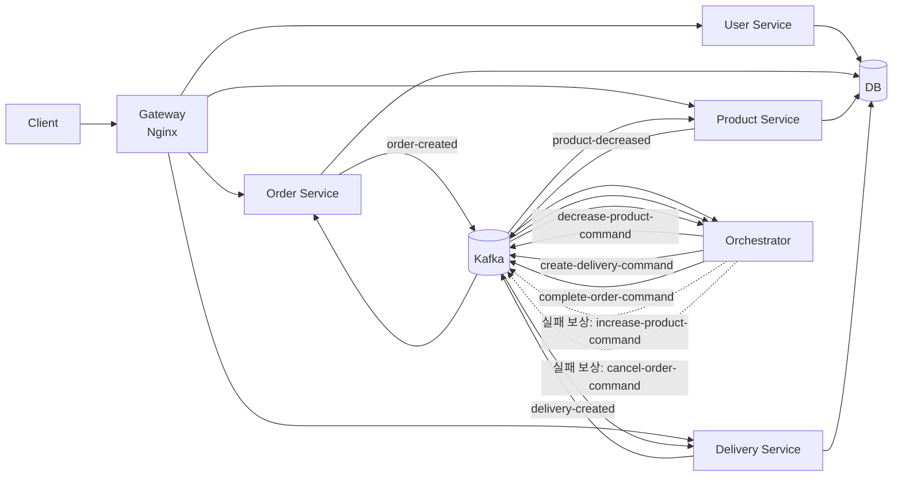
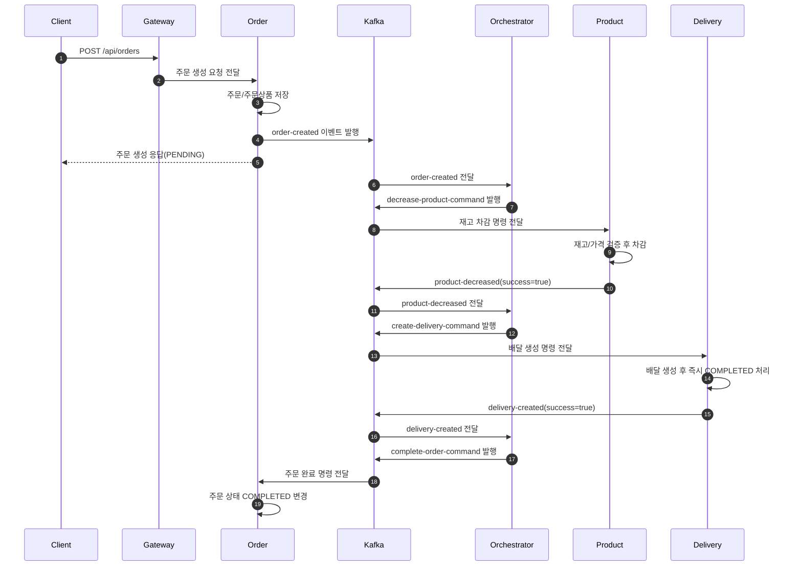
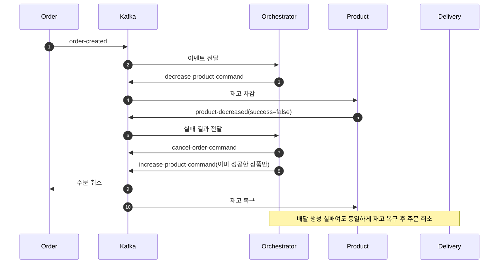

# MSA Project Study Report

기준 시점: 2026-04-14 코드 스냅샷

## 1. 이 프로젝트를 한 문장으로 요약하면

이 프로젝트는 `주문(order)`을 중심으로 `상품(product)`, `배달(delivery)`, `회원(user)` 서비스가 분리되어 있고, `orchestrator`가 Kafka를 통해 전체 주문 처리 순서를 지휘하는 `Saga Orchestration` 학습용 MSA 예제입니다.

`PIZZA.md`의 비유를 그대로 가져오면:

- `order-service` = 피자 주문 접수
- `product-service` = 재고 확인과 차감
- `delivery-service` = 배달 생성
- `orchestrator` = 전체 공정을 지휘하는 매니저
- `Kafka` = 각 서비스가 명령과 결과를 주고받는 방송국
- `gateway` = 클라이언트가 처음 만나는 입구

---

## 2. 프로젝트 구성 한눈에 보기

### 서비스 목록

| 구성요소           | 역할                        |   포트 | 비고                               |
| ------------------ | --------------------------- | -----: | ---------------------------------- |
| `gateway`          | 외부 요청 라우팅            |   `80` | Nginx                              |
| `user-service`     | 로그인, 회원 조회, JWT 발급 | `8083` | REST API                           |
| `product-service`  | 상품 조회, 재고 증감        | `8082` | REST API + Kafka Consumer          |
| `order-service`    | 주문 생성/조회/취소         | `8081` | REST API + Kafka Consumer          |
| `delivery-service` | 배달 생성/조회/취소         | `8084` | REST API + Kafka Consumer          |
| `orchestrator`     | 주문 워크플로우 제어        | `8085` | Kafka Listener 중심, 외부 API 없음 |
| `db`               | MySQL                       | `3306` | 운영용 공용 DB                     |
| `kafka`            | 비동기 메시지 브로커        | `9092` | 명령/이벤트 전달                   |

### 디렉터리 역할

- `user/`, `product/`, `order/`, `delivery/`: 각 마이크로서비스
- `orchestrator/`: Saga 흐름을 지휘하는 서비스
- `gateway/`: Nginx API Gateway
- `db/`: MySQL 초기 스키마와 더미 데이터
- `k8s/`: Kubernetes 배포 파일
- `PIZZA.md`: 동기 호출, choreography, orchestration 개념 설명

---

## 3. 아키텍처 다이어그램

### 전체 구조



### 주문 성공 시퀀스



### 주문 실패 보상 흐름



---

## 4. 클라이언트 입장에서 보는 전체 흐름

### 4-1. 로그인할 때

1. 클라이언트가 `POST /login` 호출
2. `gateway/nginx.conf`가 요청을 `user-service`로 전달
3. `UserController.login()`이 요청 바디를 받음
4. `UserService.login()`이 사용자 조회와 비밀번호 검증을 수행
5. `JwtUtil.create()`가 JWT 생성
6. 토큰이 응답으로 반환됨
7. 이후 `/api/*` 요청에는 `Authorization: Bearer ...` 헤더를 붙여야 함

### 4-2. 상품 목록을 볼 때

1. 클라이언트가 `GET /api/products`
2. `product-service`의 `JwtAuthenticationFilter.doFilterInternal()`이 토큰 검증
3. `ProductController.getAllProducts()` 실행
4. `ProductService.findAll()`이 전체 상품 조회
5. `ProductResponse` 목록이 응답됨

### 4-3. 주문할 때

1. 클라이언트가 `POST /api/orders`
2. `order-service`의 JWT 필터가 먼저 실행되어 `request.setAttribute("userId")` 저장
3. `OrderController.createOrder()`가 요청을 받음
4. `OrderService.createOrder()`가 주문과 주문상품을 DB에 저장
5. 같은 메서드 안에서 `OrderEventProducer.publishOrderCreated()`가 Kafka로 이벤트 발행
6. 클라이언트는 우선 `PENDING` 상태 주문 응답을 받음
7. 그 뒤의 재고 차감, 배달 생성, 주문 완료는 비동기로 진행됨
8. 최종 상태는 `GET /api/orders/{orderId}`로 다시 조회해야 확인 가능

### 4-4. 주문이 성공적으로 끝날 때

1. `orchestrator`가 `order-created`를 수신
2. 상품 개수만큼 `decrease-product-command` 발행
3. `product-service`가 재고를 줄인 뒤 결과 이벤트 발행
4. 모든 상품이 성공하면 `orchestrator`가 `create-delivery-command` 발행
5. `delivery-service`가 배달을 만들고 완료 이벤트 발행
6. `orchestrator`가 `complete-order-command` 발행
7. `order-service`가 주문 상태를 `COMPLETED`로 변경

### 4-5. 주문 중간에 실패할 때

1. 재고 부족 또는 가격 불일치가 발생하면 `product-service`가 실패 이벤트 발행
2. `orchestrator`가 이미 감소한 재고만 다시 복구
3. `cancel-order-command`를 보내 주문을 `CANCELLED`로 바꿈
4. 배달 생성 실패여도 같은 방식으로 주문 취소 + 재고 복구를 수행

---

## 5. API와 메시지 흐름 정리

### 외부 API

| 메서드 | 경로                          | 실제 서비스        | 설명                   |
| ------ | ----------------------------- | ------------------ | ---------------------- |
| `POST` | `/login`                      | `user-service`     | 로그인 후 JWT 발급     |
| `GET`  | `/api/users`                  | `user-service`     | 전체 회원 조회         |
| `GET`  | `/api/users/{id}`             | `user-service`     | 회원 상세 조회         |
| `GET`  | `/api/products`               | `product-service`  | 상품 목록 조회         |
| `GET`  | `/api/products/{id}`          | `product-service`  | 상품 상세 조회         |
| `PUT`  | `/api/products/{id}/decrease` | `product-service`  | 재고 감소 테스트용 API |
| `PUT`  | `/api/products/{id}/increase` | `product-service`  | 재고 증가 테스트용 API |
| `POST` | `/api/orders`                 | `order-service`    | 주문 생성              |
| `GET`  | `/api/orders/{id}`            | `order-service`    | 주문 조회              |
| `PUT`  | `/api/orders/{id}`            | `order-service`    | 주문 취소              |
| `POST` | `/api/deliveries`             | `delivery-service` | 배달 생성 테스트용 API |
| `GET`  | `/api/deliveries/{id}`        | `delivery-service` | 배달 조회              |
| `PUT`  | `/api/deliveries/{orderId}`   | `delivery-service` | 배달 취소              |

### Kafka 토픽

| 토픽                       | 보내는 쪽          | 받는 쪽               | 의미                     |
| -------------------------- | ------------------ | --------------------- | ------------------------ |
| `order-created`            | `order-service`    | `orchestrator`        | 주문이 생성되었음        |
| `order-cancelled`          | `order-service`    | 현재 직접 사용처 없음 | 주문 취소됨              |
| `decrease-product-command` | `orchestrator`     | `product-service`     | 재고를 줄여라            |
| `increase-product-command` | `orchestrator`     | `product-service`     | 재고를 복구하라          |
| `product-decreased`        | `product-service`  | `orchestrator`        | 재고 차감 성공/실패 보고 |
| `create-delivery-command`  | `orchestrator`     | `delivery-service`    | 배달을 생성하라          |
| `cancel-delivery-command`  | `orchestrator`     | `delivery-service`    | 배달을 취소하라          |
| `delivery-created`         | `delivery-service` | `orchestrator`        | 배달 생성 성공/실패 보고 |
| `complete-order-command`   | `orchestrator`     | `order-service`       | 주문을 완료하라          |
| `cancel-order-command`     | `orchestrator`     | `order-service`       | 주문을 취소하라          |

---

## 6. 서비스별 코드 읽는 순서

처음 읽을 때는 아래 순서가 가장 이해가 쉽습니다.

1. `gateway/nginx.conf`
2. `user/web/UserController.java`
3. `order/web/OrderController.java`
4. `order/usecase/OrderService.java`
5. `order/adapter/producer/OrderEventProducer.java`
6. `orchestrator/handler/OrderOrchestrator.java`
7. `product/adapter/consumer/ProductCommandConsumer.java`
8. `product/usecase/ProductService.java`
9. `delivery/adapter/consumer/DeliveryCommandConsumer.java`
10. `delivery/usecase/DeliveryService.java`

---

## 7. 주문 요청 기준 코드 추적

### 7-1. 0단계: Gateway가 주문 요청을 order-service로 전달

클라이언트가 `POST /api/orders`를 호출하면 가장 먼저 `gateway/nginx.conf`의 이 라우팅 규칙에 걸립니다.

```nginx
location /api/orders {
    proxy_pass http://order-service;
    # /api/orders 로 들어온 요청을 order-service 로 넘긴다.
    # 즉, 클라이언트는 gateway만 알면 되고 내부 서비스 주소는 몰라도 된다.
}
```

### 7-2. 1단계: order-service의 JWT 필터가 먼저 실행된다

컨트롤러보다 먼저 실행되는 코드는 `JwtAuthenticationFilter.doFilterInternal()`입니다.

#### `order/core/filter/JwtAuthenticationFilter.doFilterInternal(...)`

```java
@Override
protected void doFilterInternal(HttpServletRequest request,
                               HttpServletResponse response,
                               FilterChain filterChain) throws ServletException, IOException {
    // Authorization 헤더에서 Bearer 토큰을 꺼낸다.
    String token = jwtProvider.resolveToken(request);

    // 토큰이 없거나 유효하지 않으면 바로 401을 내려서 요청을 막는다.
    if (token == null || !jwtProvider.validateToken(token)) {
        response.sendError(HttpServletResponse.SC_UNAUTHORIZED, "인증이 필요합니다");
        return;
    }

    // 토큰이 유효하면 그 안에서 userId를 꺼낸다.
    Integer userId = jwtProvider.getUserId(request);

    if (userId != null) {
        // 이후 컨트롤러가 사용할 수 있도록 request attribute에 저장한다.
        request.setAttribute("userId", userId);
        filterChain.doFilter(request, response);
        // 여기서 다음 단계로 요청을 넘기면 이제 컨트롤러가 실행된다.
    } else {
        response.sendError(HttpServletResponse.SC_UNAUTHORIZED, "인증이 필요합니다");
        return;
    }
}
```

이 메서드는 내부에서 `JwtProvider.resolveToken()`, `JwtProvider.validateToken()`, `JwtProvider.getUserId()`를 호출합니다.

#### `order/core/util/JwtProvider.resolveToken(...)`

```java
public String resolveToken(HttpServletRequest request) {
    // Authorization 헤더 값을 읽는다. 예: "Bearer eyJ..."
    String bearerToken = request.getHeader(JwtUtil.HEADER);

    // Bearer 접두사가 있으면 실제 토큰 문자열만 잘라서 반환한다.
    if (bearerToken != null && bearerToken.startsWith(JwtUtil.TOKEN_PREFIX)) {
        return bearerToken.replace(JwtUtil.TOKEN_PREFIX, "");
    }

    // 토큰이 없거나 형식이 다르면 null 반환
    return null;
}
```

#### `order/core/util/JwtProvider.validateToken(...)`

```java
public boolean validateToken(String token) {
    // 실제 토큰 검증은 JwtUtil에 위임한다.
    return jwtUtil.validateToken(token);
}
```

#### `order/core/util/JwtUtil.validateToken(...)`

```java
public boolean validateToken(String token) {
    try {
        // verify()에서 서명, 만료시간 등을 확인한다.
        verify(token);
        return true;
    } catch (Exception e) {
        // 예외가 나면 유효하지 않은 토큰으로 본다.
        return false;
    }
}
```

#### `order/core/util/JwtUtil.verify(...)`

```java
public DecodedJWT verify(String token) {
    return JWT.require(Algorithm.HMAC512(secret))
            .build()
            .verify(token);
    // secret 키로 토큰 서명을 검증한다.
    // 만료되었거나 위조된 토큰이면 여기서 예외가 난다.
}
```

#### `order/core/util/JwtProvider.getUserId(...)`

```java
public Integer getUserId(HttpServletRequest request) {
    // 다시 요청에서 토큰을 꺼낸다.
    String token = resolveToken(request);

    // 토큰이 있고, 유효하면 userId를 읽어온다.
    if (token != null && jwtUtil.validateToken(token)) {
        return jwtUtil.getUserId(token);
    }

    return null;
}
```

#### `order/core/util/JwtUtil.getUserId(...)`

```java
public int getUserId(String token) {
    // verify()를 통해 검증된 토큰을 디코딩한다.
    DecodedJWT decodedJWT = verify(token);

    // 이 프로젝트에서는 userId를 subject에 넣어뒀기 때문에 꺼내서 int로 변환한다.
    return Integer.parseInt(decodedJWT.getSubject());
}
```

여기까지 끝나면 `request` 안에는 `userId`가 들어 있고, 이제 주문 컨트롤러가 실행됩니다.

### 7-3. 2단계: OrderController가 주문 요청을 받는다

#### `order/web/OrderController.createOrder(...)`

```java
@PostMapping
public ResponseEntity<?> createOrder(@RequestBody OrderRequest requestDTO,
                                     @RequestAttribute("userId") Integer userId) {
    // requestDTO 안에는 주문상품 목록과 주소가 들어 있다.
    // userId는 방금 JWT 필터가 request attribute에 넣어둔 값이다.
    return Resp.ok(createOrderUseCase.createOrder(userId,
            requestDTO.orderItems(),
            requestDTO.address()));
    // 진짜 핵심 작업은 OrderService.createOrder()로 위임한다.
}
```

이 메서드는 내부에서 `OrderService.createOrder()`를 호출합니다.

### 7-4. 3단계: OrderService가 주문/주문상품을 저장하고 이벤트를 발행한다

#### `order/usecase/OrderService.createOrder(...)`

```java
@Override
@Transactional
public OrderResponse createOrder(int userId, List<OrderRequest.OrderItemDTO> orderItems, String address) {
    // 1. 주문 헤더(order_tb)를 먼저 저장한다.
    Order createdOrder = orderRepository.save(Order.create(userId));
    final int orderId = createdOrder.getId();

    // 2. 요청으로 들어온 주문상품들을 OrderItem 엔티티로 바꾼다.
    List<OrderItem> createdOrderItems = orderItems.stream()
            .map(item -> OrderItem.create(orderId, item.productId(), item.quantity(), item.price()))
            .toList();

    // 3. 주문상품(order_item_tb)을 한 번에 저장한다.
    orderItemRepository.saveAll(createdOrderItems);

    // 4. Kafka로 보낼 메시지용 DTO를 만든다.
    //    엔티티를 그대로 보내지 않고 이벤트 전용 객체로 다시 만든다.
    List<OrderCreatedEvent.OrderItem> messageItems = orderItems.stream()
            .map(item -> new OrderCreatedEvent.OrderItem(item.productId(), item.quantity(), item.price()))
            .toList();

    // 5. "주문이 생성되었다"는 이벤트를 Kafka에 발행한다.
    orderEventProducer.publishOrderCreated(new OrderCreatedEvent(orderId, userId, address, messageItems));

    // 6. 클라이언트에게는 우선 저장된 주문 정보를 응답한다.
    //    이 시점 상태는 PENDING이며, 이후 saga가 비동기로 계속 진행된다.
    return OrderResponse.from(createdOrder, createdOrderItems);
}
```

이 메서드는 내부에서 `Order.create()`, `OrderItem.create()`, `OrderEventProducer.publishOrderCreated()`를 호출합니다.

#### `order/domain/Order.create(...)`

```java
public static Order create(int userId) {
    return new Order(userId, OrderStatus.PENDING);
    // 새 주문을 만들 때 기본 상태를 PENDING으로 둔다.
    // 아직 재고 차감과 배달 생성이 끝나지 않았기 때문이다.
}
```

#### `order/domain/OrderItem.create(...)`

```java
public static OrderItem create(int orderId, int productId, int quantity, Long price) {
    return new OrderItem(orderId, productId, quantity, price);
    // 주문상품 엔티티를 만든다.
    // 어떤 주문의 몇 번 상품을 몇 개 얼마에 샀는지를 저장한다.
}
```

#### `order/adapter/producer/OrderEventProducer.publishOrderCreated(...)`

```java
public void publishOrderCreated(OrderCreatedEvent event) {
    kafkaTemplate.send("order-created", event);
    // order-created 토픽으로 이벤트를 보낸다.
    // 이제 orchestrator가 이 이벤트를 받고 다음 단계를 시작한다.

    System.out.println("order 이벤트 생성");
}
```

여기서 중요한 점은:

- 클라이언트 요청은 `order-service`에서 끝난 것처럼 보이지만
- 실제 비즈니스 흐름은 이제부터 Kafka를 통해 계속 이어진다는 점입니다.

### 7-5. 4단계: orchestrator가 주문 생성 이벤트를 받아 재고 차감 명령을 보낸다

#### `orchestrator/handler/OrderOrchestrator.orderCreated(...)`

```java
@KafkaListener(topics = "order-created", groupId = "orchestrator")
public void orderCreated(OrderCreatedEvent event) {
    int orderId = event.getOrderId();

    // 이벤트 안의 주문상품 목록을 안전하게 복사한다.
    List<OrderCreatedEvent.OrderItem> items = List.copyOf(event.getOrderItems());

    // 이 주문의 진행 상태를 메모리에 저장한다.
    // 나중에 실패했을 때 무엇을 복구할지 기억해야 하기 때문이다.
    states.put(orderId, new WorkflowState(orderId, event.getAddress(), items));

    // 주문상품 하나마다 재고 차감 명령을 발행한다.
    for (OrderCreatedEvent.OrderItem item : items) {
        kafkaTemplate.send(
                "decrease-product-command",
                String.valueOf(orderId),
                new DecreaseProductCommand(
                        orderId,
                        item.getProductId(),
                        item.getQuantity(),
                        item.getPrice()
                )
        );
        // "이 주문의 이 상품 재고를 줄여라"라는 명령을 product-service에 보낸다.
    }
}
```

이제 `product-service`가 `decrease-product-command`를 받습니다.

### 7-6. 5단계: product-service가 재고를 차감하고 결과를 보고한다

#### `product/adapter/consumer/ProductCommandConsumer.decreaseProductCommand(...)`

```java
@KafkaListener(topics = "decrease-product-command", groupId = "product-service")
public void decreaseProductCommand(DecreaseProductCommand command) {
    boolean success = false;

    try {
        // 실제 재고 차감 비즈니스 로직 수행
        productService.decreaseQuantity(command.getProductId(), command.getQuantity(), command.getPrice());
        success = true;
    } catch (Exception e) {
        // 실패해도 여기서 예외를 던져 끝내지 않고
        // 반드시 orchestrator에게 실패 사실을 알려야 한다.
        System.out.println("재고 감소 실패: " + e.getMessage());
    }

    productEventProducer.publishProductDecreased(
            new ProductDecreasedEvent(command.getOrderId(), command.getProductId(), command.getQuantity(), success));
    // 성공이든 실패든 결과 이벤트를 발행한다.
}
```

이 메서드는 `ProductService.decreaseQuantity()`를 호출합니다.

#### `product/usecase/ProductService.decreaseQuantity(...)`

```java
@Override
@Transactional
public ProductResponse decreaseQuantity(int productId, int quantity, Long price) {
    Product findProduct = productRepository.findById(productId)
            .orElseThrow(() -> new Exception404("상품이 없습니다."));
    // 먼저 상품이 존재하는지 확인한다.

    findProduct.validateQuantity(quantity);
    // 재고가 충분한지 검사한다.

    findProduct.validatePrice(price);
    // 클라이언트가 보낸 가격과 실제 DB 가격이 일치하는지 확인한다.
    // 가격 위변조 방지 개념이 들어가 있다.

    findProduct.decreaseQuantity(quantity);
    // 검증이 끝났으면 실제 수량을 감소시킨다.

    return ProductResponse.from(findProduct);
}
```

이 메서드는 `Product.validateQuantity()`, `Product.validatePrice()`, `Product.decreaseQuantity()`를 호출합니다.

#### `product/domain/Product.validateQuantity(...)`

```java
public void validateQuantity(int quantity) {
    if (this.quantity < quantity) {
        throw new Exception400("상품 재고가 부족합니다.");
    }
    // 주문 수량이 현재 재고보다 크면 예외를 던진다.
}
```

#### `product/domain/Product.validatePrice(...)`

```java
public void validatePrice(Long price) {
    if (!price.equals(this.price)) {
        throw new Exception400("상품 가격이 일치하지 않습니다.");
    }
    // 주문 시점 가격과 DB 가격이 다르면 진행하지 않는다.
}
```

#### `product/domain/Product.decreaseQuantity(...)`

```java
public void decreaseQuantity(int quantity) {
    this.quantity -= quantity;
    this.updatedAt = LocalDateTime.now();
    // 실제 재고를 줄이고 수정 시각을 갱신한다.
}
```

재고 차감이 끝나면 결과 이벤트를 발행합니다.

#### `product/adapter/producer/ProductEventProducer.publishProductDecreased(...)`

```java
public void publishProductDecreased(ProductDecreasedEvent event) {
    kafkaTemplate.send("product-decreased", event);
    // orchestrator에게 "재고 차감 성공/실패"를 보고한다.

    System.out.println("product 이벤트 생성");
}
```

### 7-7. 6단계: orchestrator가 재고 차감 결과를 모아 배달 생성 여부를 결정한다

#### `orchestrator/handler/OrderOrchestrator.productDecreased(...)`

```java
@KafkaListener(topics = "product-decreased", groupId = "orchestrator")
public void productDecreased(ProductDecreasedEvent event) {
    int orderId = event.getOrderId();

    // 현재 주문의 워크플로우 상태를 가져온다.
    WorkflowState state = states.get(orderId);

    // 이미 정리된 주문이면 더 이상 처리하지 않는다.
    if (state == null) return;

    // 하나라도 실패하면 보상 트랜잭션을 시작한다.
    if (!event.isSuccess()) {
        for (OrderCreatedEvent.OrderItem item : state.items) {
            if (state.decreasedProductIds.contains(item.getProductId())) {
                kafkaTemplate.send(
                        "increase-product-command",
                        String.valueOf(orderId),
                        new IncreaseProductCommand(
                                orderId,
                                item.getProductId(),
                                item.getQuantity(),
                                item.getPrice()
                        )
                );
                // 이미 성공적으로 차감된 상품만 다시 복구한다.
            }
        }

        kafkaTemplate.send(
                "cancel-order-command",
                String.valueOf(orderId),
                new CancelOrderCommand(orderId)
        );
        // 주문 자체를 취소한다.

        states.remove(orderId);
        return;
    }

    // 성공한 상품은 기록해둔다.
    state.decreasedProductIds.add(event.getProductId());
    state.processed++;

    // 주문상품 수만큼 전부 성공했을 때만 배달 생성 단계로 넘어간다.
    if (state.processed == state.getItems().size()) {
        kafkaTemplate.send(
                "create-delivery-command",
                String.valueOf(orderId),
                new CreateDeliveryCommand(orderId, state.address)
        );
    }
}
```

이 메서드의 성공 분기에서는 `delivery-service`로 명령이 넘어가고, 실패 분기에서는 `product-service` 재고 복구와 `order-service` 주문 취소가 호출됩니다.

### 7-8. 7단계: delivery-service가 배달을 생성하고 결과를 보고한다

#### `delivery/adapter/consumer/DeliveryCommandConsumer.createDeliveryCommand(...)`

```java
@KafkaListener(topics = "create-delivery-command", groupId = "delivery-service")
public void createDeliveryCommand(CreateDeliveryCommand command) {
    boolean success = false;
    int deliveryId = 0;

    try {
        // 실제 배달 생성 수행
        var response = deliveryService.createDelivery(command.getOrderId(), command.getAddress());
        success = true;
        deliveryId = response.id();
    } catch (Exception e) {
        // 실패해도 역시 결과를 orchestrator에 알려야 한다.
        System.out.println("배달 생성 실패: " + e.getMessage());
    }

    deliveryEventProducer.publishDeliveryCreated(
            new DeliveryCreatedEvent(command.getOrderId(), deliveryId, success));
}
```

이 메서드는 `DeliveryService.createDelivery()`를 호출합니다.

#### `delivery/usecase/DeliveryService.createDelivery(...)`

```java
@Override
@Transactional
public DeliveryResponse createDelivery(int orderId, String address) {
    // 1. delivery_tb에 배달 엔티티를 저장한다.
    Delivery createdDelivery = deliveryRepository.save(Delivery.create(orderId, address));

    // 2. 주소가 비어 있는지 확인한다.
    Delivery.validateAddress(address);

    // 3. 현재 예제에서는 배달 생성 직후 바로 완료 상태로 바꾼다.
    createdDelivery.complete();

    return DeliveryResponse.from(createdDelivery);
}
```

이 메서드는 `Delivery.create()`, `Delivery.validateAddress()`, `Delivery.complete()`를 호출합니다.

#### `delivery/domain/Delivery.create(...)`

```java
public static Delivery create(int orderId, String address) {
    return new Delivery(orderId, address, DeliveryStatus.PENDING);
    // 새 배달을 PENDING 상태로 만든다.
}
```

#### `delivery/domain/Delivery.validateAddress(...)`

```java
public static void validateAddress(String address) {
    if (address == null || address.isBlank()) {
        throw new Exception400("배달 주소는 필수입니다.");
    }
    // 주소가 비어 있으면 배달 생성 실패로 처리한다.
}
```

#### `delivery/domain/Delivery.complete()`

```java
public void complete() {
    this.status = DeliveryStatus.COMPLETED;
    this.updatedAt = LocalDateTime.now();
    // 이 예제에서는 "배달 생성 성공"을 보여주기 위해 바로 COMPLETED로 바꾼다.
}
```

배달 생성이 끝나면 결과 이벤트를 발행합니다.

#### `delivery/adapter/producer/DeliveryEventProducer.publishDeliveryCreated(...)`

```java
public void publishDeliveryCreated(DeliveryCreatedEvent event) {
    kafkaTemplate.send("delivery-created", event);
    // orchestrator에게 배달 생성 성공/실패를 보고한다.

    System.out.println("delivery 이벤트 생성");
}
```

### 7-9. 8단계: orchestrator가 배달 생성 결과를 받아 주문 완료를 지시한다

#### `orchestrator/handler/OrderOrchestrator.deliveryCreated(...)`

```java
@KafkaListener(topics = "delivery-created", groupId = "orchestrator")
public void deliveryCreated(DeliveryCreatedEvent event) {
    int orderId = event.getOrderId();
    WorkflowState state = states.get(orderId);

    if (state == null) return;

    // 배달 생성 실패면 이미 차감된 재고를 복구하고 주문을 취소한다.
    if (!event.isSuccess()) {
        for (OrderCreatedEvent.OrderItem item : state.items) {
            if (state.decreasedProductIds.contains(item.getProductId())) {
                kafkaTemplate.send(
                        "increase-product-command",
                        String.valueOf(orderId),
                        new IncreaseProductCommand(
                                orderId,
                                item.getProductId(),
                                item.getQuantity(),
                                item.getPrice()
                        )
                );
            }
        }

        kafkaTemplate.send(
                "cancel-order-command",
                String.valueOf(orderId),
                new CancelOrderCommand(orderId)
        );

        states.remove(orderId);
        return;
    }

    // 배달 생성까지 성공했으면 이제 주문 완료 명령을 보낸다.
    kafkaTemplate.send(
            "complete-order-command",
            String.valueOf(orderId),
            new CompleteOrderCommand(orderId)
    );

    // 주문 워크플로우가 끝났으므로 메모리 상태를 제거한다.
    states.remove(orderId);
}
```

이제 `order-service`가 주문 완료 명령을 받습니다.

### 7-10. 9단계: order-service가 주문 상태를 COMPLETED로 바꾼다

#### `order/adapter/consumer/OrderCommandConsumer.completeOrderCommand(...)`

```java
@KafkaListener(topics = "complete-order-command", groupId = "order-service")
public void completeOrderCommand(CompleteOrderCommand command) {
    orderService.completeOrder(command.getOrderId());
    // orchestrator가 보낸 주문 완료 명령을 서비스 계층으로 전달한다.
}
```

#### `order/usecase/OrderService.completeOrder(...)`

```java
@Transactional
public void completeOrder(int orderId) {
    Order findOrder = orderRepository.findById(orderId)
            .orElseThrow(() -> new Exception404("주문을 찾을 수 없습니다."));
    // 완료 처리할 주문을 찾는다.

    findOrder.complete();
    // 주문 상태를 COMPLETED로 바꾼다.
}
```

#### `order/domain/Order.complete()`

```java
public void complete() {
    this.status = OrderStatus.COMPLETED;
    this.updatedAt = LocalDateTime.now();
    // 주문 성공의 최종 상태를 기록한다.
}
```

여기까지가 주문 성공 흐름입니다.

### 7-11. 실패 시 실제로 호출되는 보상 코드

주문은 성공 흐름만 보면 쉬워 보이지만, 이 프로젝트의 핵심은 실패했을 때입니다.

#### 재고 복구 명령을 받는 메서드

```java
@KafkaListener(topics = "increase-product-command", groupId = "product-service")
public void increaseProductCommand(IncreaseProductCommand command) {
    productService.increaseQuantity(command.getProductId(), command.getQuantity(), command.getPrice());
    // 이전에 줄였던 재고를 다시 복구한다.
}
```

#### `product/usecase/ProductService.increaseQuantity(...)`

```java
@Override
@Transactional
public ProductResponse increaseQuantity(int productId, int quantity, Long price) {
    Product findProduct = productRepository.findById(productId)
            .orElseThrow(() -> new Exception404("상품이 없습니다."));
    // 복구할 상품을 찾는다.

    findProduct.validatePrice(price);
    // 엉뚱한 상품 가격으로 복구하지 않도록 가격을 다시 확인한다.

    findProduct.increaseQuantity(quantity);
    // 수량을 다시 늘린다.

    return ProductResponse.from(findProduct);
}
```

#### `product/domain/Product.increaseQuantity(...)`

```java
public void increaseQuantity(int quantity) {
    this.quantity += quantity;
    this.updatedAt = LocalDateTime.now();
    // 줄였던 재고를 다시 되돌린다.
}
```

#### 주문 취소 명령을 받는 메서드

```java
@KafkaListener(topics = "cancel-order-command", groupId = "order-service")
public void cancelOrderCommand(CancelOrderCommand command) {
    orderService.cancelOrder(command.getOrderId());
    // orchestrator가 보낸 주문 취소 명령을 처리한다.
}
```

#### `order/usecase/OrderService.cancelOrder(...)`

```java
@Override
@Transactional
public OrderResponse cancelOrder(int orderId) {
    Order findOrder = orderRepository.findById(orderId)
            .orElseThrow(() -> new Exception404("주문을 찾을 수 없습니다."));

    List<OrderItem> findOrderItems = orderItemRepository.findByOrderId(orderId)
            .orElseThrow(() -> new Exception404("주문 아이템을 찾을 수 없습니다."));

    findOrder.cancel();
    // 주문 상태를 CANCELLED로 바꾼다.

    List<OrderCancelledEvent.OrderItem> items = findOrderItems.stream()
            .map(item -> new OrderCancelledEvent.OrderItem(item.getProductId(), item.getQuantity(), item.getPrice()))
            .toList();
    // 취소 이벤트용 메시지 객체를 만든다.

    orderEventProducer.publishOrderCancelled(new OrderCancelledEvent(orderId, items));
    // 현재 코드에서는 직접 사용처가 약하지만, 취소 이벤트를 남긴다.

    return OrderResponse.from(findOrder);
}
```

#### `order/domain/Order.cancel()`

```java
public void cancel() {
    validateCancelable();
    // 이미 취소된 주문을 또 취소하지 못하게 막는다.

    this.status = OrderStatus.CANCELLED;
    this.updatedAt = LocalDateTime.now();
}
```

#### `order/domain/Order.validateCancelable()`

```java
public void validateCancelable() {
    if (this.status == OrderStatus.CANCELLED) {
        throw new Exception400("주문이 이미 취소되었습니다.");
    }
}
```

### 7-12. 한 줄로 다시 묶은 호출 체인

성공 흐름:

```text
POST /api/orders
-> JwtAuthenticationFilter.doFilterInternal()
-> OrderController.createOrder()
-> OrderService.createOrder()
-> Order.create()
-> OrderItem.create()
-> OrderEventProducer.publishOrderCreated()
-> OrderOrchestrator.orderCreated()
-> ProductCommandConsumer.decreaseProductCommand()
-> ProductService.decreaseQuantity()
-> Product.validateQuantity()
-> Product.validatePrice()
-> Product.decreaseQuantity()
-> ProductEventProducer.publishProductDecreased()
-> OrderOrchestrator.productDecreased()
-> DeliveryCommandConsumer.createDeliveryCommand()
-> DeliveryService.createDelivery()
-> Delivery.create()
-> Delivery.validateAddress()
-> Delivery.complete()
-> DeliveryEventProducer.publishDeliveryCreated()
-> OrderOrchestrator.deliveryCreated()
-> OrderCommandConsumer.completeOrderCommand()
-> OrderService.completeOrder()
-> Order.complete()
```

실패 흐름:

```text
POST /api/orders
-> ... 중간까지 동일 ...
-> ProductService.decreaseQuantity() 또는 DeliveryService.createDelivery() 에서 실패
-> OrderOrchestrator.productDecreased() 또는 deliveryCreated() 실패 분기
-> ProductCommandConsumer.increaseProductCommand()
-> ProductService.increaseQuantity()
-> Product.increaseQuantity()
-> OrderCommandConsumer.cancelOrderCommand()
-> OrderService.cancelOrder()
-> Order.cancel()
```

---

## 8. 이 프로젝트를 이해하려면 반드시 알아야 할 개념

비전공자도 이해하기 쉽게 풀어쓰면 아래와 같습니다.

### 8-1. MSA(Microservice Architecture)

하나의 큰 프로그램을 잘게 나눈 뒤, 역할별로 따로 실행하는 방식입니다.

- 장점
  - 주문 기능만 따로 고칠 수 있음
  - 상품 서비스만 따로 늘릴 수 있음
  - 장애가 나도 전체가 한 번에 무너지지 않게 설계 가능

- 단점
  - 서비스끼리 대화가 많아져서 흐름이 복잡해짐
  - 데이터 일관성을 맞추기가 어려워짐

이 프로젝트는 바로 그 "복잡해지는 흐름"을 배우기 위한 예제입니다.

### 8-2. API Gateway

고객이 건물 안 여러 부서를 직접 찾지 않고, 1층 안내데스크를 먼저 가는 것과 같습니다.

- 클라이언트는 `gateway`만 알면 됨
- 내부적으로 어떤 서비스가 처리할지는 `nginx.conf`가 정함
- 외부 진입점을 하나로 통일할 수 있음

### 8-3. JWT

로그인 성공 후 발급받는 "전자 출입증"입니다.

- 로그인하면 토큰을 받음
- 이후 요청 때 이 토큰을 헤더에 담아 보냄
- 각 서비스는 토큰이 진짜인지 검사함
- 진짜면 "이 요청은 몇 번 사용자 것"인지 알아냄

이 프로젝트에서는 각 서비스가 직접 JWT를 검증합니다.

### 8-4. Controller / Service / Repository / Entity

Spring 프로젝트에서 자주 보는 역할 분담입니다.

- `Controller`
  - 손님 요청을 받는 창구
- `Service`
  - 진짜 비즈니스 규칙을 처리하는 두뇌
- `Repository`
  - DB와 대화하는 창구
- `Entity`
  - DB 테이블과 1:1 느낌으로 연결되는 객체

이 구조를 알면 코드를 읽을 때 "어디에 어떤 로직이 있어야 하는지" 감이 잡힙니다.

### 8-5. 트랜잭션(Transaction)

작업 여러 개를 하나로 묶어서 "전부 성공하거나, 전부 실패하게" 만드는 장치입니다.

예를 들어:

- 주문 저장 성공
- 주문상품 저장 성공
- 그런데 중간에 예외 발생

이때 트랜잭션이 있으면 앞에서 저장한 것도 함께 취소할 수 있습니다.

### 8-6. Kafka

서비스끼리 직접 전화하지 않고, 방송국에 메시지를 남기는 방식입니다.

- 보내는 쪽: "이 일 생겼어요"
- 받는 쪽: "그 방송을 듣고 내 일을 시작"

장점은 서로 덜 붙어 있다는 점입니다.
하지만 흐름을 머릿속으로 따라가기가 훨씬 어려워집니다.

### 8-7. Event와 Command의 차이

이 프로젝트에서 정말 중요합니다.

- `Event`
  - "이미 일어난 사실"을 알림
  - 예: `order-created`, `delivery-created`

- `Command`
  - "이제 이 일을 해라"라는 지시
  - 예: `decrease-product-command`, `complete-order-command`

`PIZZA.md`에서 말한 "매니저의 명령(Command)과 작업 완료 보고(Event)"가 정확히 여기 구현되어 있습니다.

### 8-8. Saga Orchestration

분산 환경에서는 한 DB 트랜잭션으로 모든 서비스 작업을 묶을 수 없습니다.
그래서 "서비스별 로컬 작업 + 실패 시 되돌리는 보상 작업"으로 처리합니다.

이 프로젝트에서는:

- 주문 생성
- 재고 차감
- 배달 생성
- 주문 완료

순으로 진행되고,

- 재고 차감 실패 또는 배달 생성 실패 시
- 이미 줄인 재고를 다시 복구하고
- 주문을 취소합니다

즉, 한 번에 되돌리는 대신 "반대 동작"을 따로 실행합니다.

이게 `보상 트랜잭션(compensation transaction)`입니다.

---

## 9. 이 프로젝트에 들어간 어려운 기술/기능 쉽게 풀어보기

### 9-1. 비동기 처리

클라이언트가 주문을 넣었을 때, 화면에서는 주문 생성 응답이 먼저 돌아옵니다.
하지만 내부에서는 재고 차감, 배달 생성, 주문 완료가 나중에 이어집니다.

즉:

- 겉으로는 "주문이 생성됨"
- 실제 내부 완료는 "조금 뒤에 끝남"

그래서 클라이언트는 생성 응답만 보고 끝내면 안 되고, 다시 조회해서 최종 상태를 봐야 합니다.

### 9-2. 보상 처리

중간에 실패했다고 해서 이전 서비스를 시간 되돌리듯 취소할 수는 없습니다.
그래서 반대로 행동합니다.

- 줄였던 재고는 다시 늘림
- 진행 중인 주문은 취소 상태로 바꿈

이게 분산 시스템에서 가장 어려운 부분 중 하나입니다.

### 9-3. 메모리 기반 워크플로우 상태 관리

`OrderOrchestrator`는 `ConcurrentHashMap<Integer, WorkflowState>`에 진행 중 주문 상태를 저장합니다.

쉽게 말하면:

- 주문별로 작은 메모장을 하나씩 들고 있다가
- "지금 몇 개 상품이 성공했는지"
- "어떤 상품을 복구해야 하는지"
- "배달 주소가 뭔지"

를 기억합니다.

이 방식은 학습용으로는 이해가 쉽지만, 운영 환경에서는 서버 재시작 시 메모장이 사라지는 문제가 있습니다.

### 9-4. Kafka JSON 직렬화/역직렬화

자바 객체를 그대로 보내는 것이 아니라 JSON 형태로 바꿔서 Kafka에 실어 보냅니다.

- 보낼 때: 객체 -> JSON
- 받을 때: JSON -> 객체

`KafkaConfig.recordMessageConverter()`가 이 과정을 편하게 만들어줍니다.

### 9-5. 환경 분리

이 프로젝트는 개발 환경과 운영 환경 설정이 다릅니다.

- `dev`
  - H2 메모리 DB 사용
  - `data.sql`로 샘플 데이터 자동 삽입
- `prod`
  - MySQL 사용
  - Kubernetes `ConfigMap`, `Secret`에서 환경변수 주입

즉, 같은 코드라도 실행 환경에 따라 DB 연결 방식이 바뀝니다.

---

## 10. 현재 코드 기준으로 꼭 짚고 넘어갈 특징

학습용으로 볼 때 특히 중요한 포인트입니다.

### 10-1. `orchestrator`는 외부 API가 없다

REST 컨트롤러가 없고 Kafka Listener만 있습니다.
즉, 사용자가 직접 부르는 서비스가 아니라 서비스들 사이의 흐름을 관리하는 내부 매니저입니다.

### 10-2. `delivery-service`는 생성 직후 바로 완료된다

`DeliveryService.createDelivery()`는 배달을 만든 뒤 바로 `complete()`를 호출합니다.
즉, "배달 준비중 -> 배달중 -> 배달완료" 같은 실제 배송 단계는 아직 모델링하지 않습니다.

### 10-3. 운영 환경에서는 DB가 사실상 하나다

서비스는 분리되어 있지만 `k8s/*-configmap.yml`을 보면 모두 같은 MySQL `metadb`를 사용합니다.
즉, 완전한 의미의 "서비스별 독립 DB" 구조는 아닙니다.

학습용 데모에서는 단순화에 도움이 되지만, 실무에서는 서비스별 DB 분리가 더 자주 논의됩니다.

### 10-4. `order-cancelled` 이벤트는 발행되지만 중심 흐름에는 아직 연결이 약하다

`OrderService.cancelOrder()`는 `order-cancelled`를 발행하지만, 현재 코드에서 이를 적극적으로 소비하는 곳은 보이지 않습니다.
즉, 사용자가 직접 주문 취소 API를 호출했을 때 saga 전체 취소가 자동으로 연결되는 구조는 아직 약합니다.

### 10-5. `CancelDeliveryCommand`는 정의돼 있지만 현재 핵심 성공/실패 흐름에서 거의 쓰이지 않는다

즉, 배달 취소에 대한 확장 여지는 있지만 현재는 주문 생성 성공/실패 데모에 초점이 맞춰져 있습니다.

---

## 11. 데이터 모델 요약

### `user_tb`

- `id`
- `username`
- `email`
- `password`
- `roles`

### `product_tb`

- `id`
- `product_name`
- `quantity`
- `price`

### `order_tb`

- `id`
- `user_id`
- `status`

### `order_item_tb`

- `id`
- `order_id`
- `product_id`
- `quantity`
- `price`

### `delivery_tb`

- `id`
- `order_id`
- `address`
- `status`

---

## 12. 설정 파일에서 읽히는 실행 구조

### 개발 환경

- 각 서비스는 `application.properties`에서 기본 프로필을 `dev`로 사용
- `dev`에서는 H2 메모리 DB 사용
- 각 서비스의 `db/data.sql`이 초기 데이터 로딩
- Kafka 기본 주소는 `localhost:9092`

### 운영 환경

- Kubernetes 배포 시 `SPRING_PROFILES_ACTIVE=prod`
- DB는 `db-service:3306`
- Kafka는 `kafka-service:9092`
- 민감한 값은 `Secret`
- 공통 환경값은 `ConfigMap`

### Docker 실행 방식

- 각 스프링 서비스는 `gradle clean bootJar -x test` 후 `java -jar app.jar`
- `gateway`는 `nginx:alpine`
- `db`는 `mysql` 이미지에 `init.sql`을 복사

---

## 13. 공부할 때 추천 순서

### 1단계: 큰 그림 이해

1. `PIZZA.md`
2. 이 문서의 머메이드 다이어그램
3. `gateway/nginx.conf`
4. `orchestrator/handler/OrderOrchestrator.java`

### 2단계: API에서 이벤트까지 연결

1. `user/web/UserController.java`
2. `order/web/OrderController.java`
3. `order/usecase/OrderService.java`
4. `order/adapter/producer/OrderEventProducer.java`

### 3단계: 오케스트레이션 이후 흐름

1. `product/adapter/consumer/ProductCommandConsumer.java`
2. `product/usecase/ProductService.java`
3. `delivery/adapter/consumer/DeliveryCommandConsumer.java`
4. `delivery/usecase/DeliveryService.java`

### 4단계: 공통 기반기술

1. 각 서비스의 `JwtAuthenticationFilter`
2. 각 서비스의 `KafkaConfig`
3. 각 서비스의 `GlobalExceptionHandler`
4. `db/init.sql`
5. `k8s/*`

---

## 14. 최종 요약

이 프로젝트의 핵심은 "주문 생성 자체"가 아니라, `주문 -> 재고 -> 배달 -> 주문완료`로 이어지는 분산 워크플로우를 `orchestrator`가 어떻게 지휘하는지에 있습니다.

가장 중요한 코드 3개만 꼽으면:

1. `order/usecase/OrderService.createOrder()`
   - `// saga 시작 이벤트를 만드는 메서드`
2. `orchestrator/handler/OrderOrchestrator`
   - `// 전체 순서와 실패 보상을 지휘하는 핵심 메서드 집합`
3. `product/adapter/consumer/ProductCommandConsumer` + `delivery/adapter/consumer/DeliveryCommandConsumer`
   - `// 명령을 실제 실행하고 결과 이벤트를 다시 보고하는 실행부`

즉, 이 프로젝트는 "MSA에서 여러 서비스가 함께 하나의 주문을 완성하는 방법"과 "중간 실패를 어떻게 되돌리는지"를 배우기 가장 좋은 구조로 되어 있습니다.
